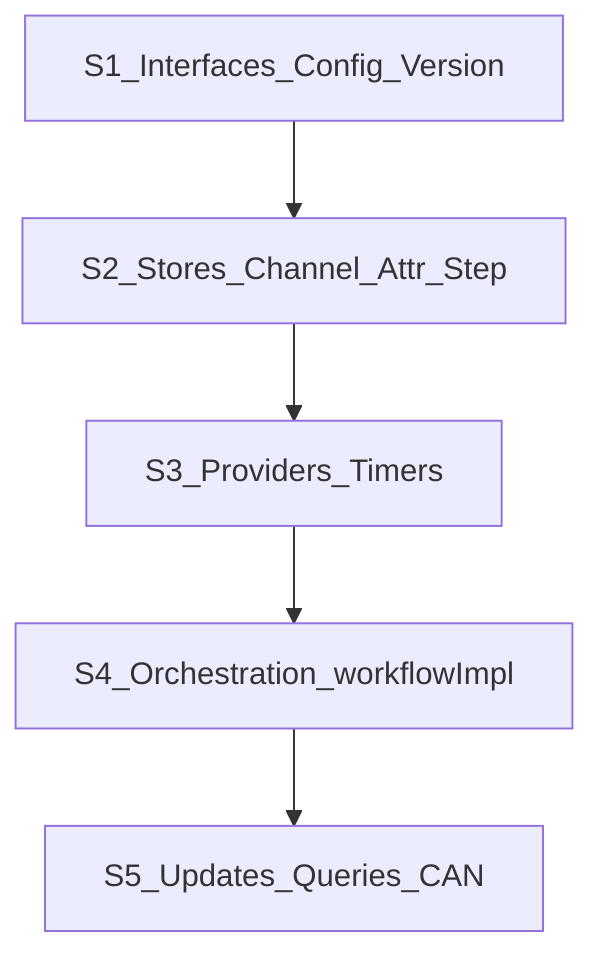

# Phase 4 — Interpreter rewrite (careful execution)

Detailed execution plan for Phase 4 of the server rewrite. Parent plan:
[`server-rewrite-plan.md`](server-rewrite-plan.md).

Phase 4 is the largest remaining slice. **Pacing:** work in the 5 review slices
below; stop after each for review before continuing. Files in S2/S4/S5 share the
same Go package, so S1–S4 are stacked review checkpoints, not independently
mergeable green commits. Do not land them separately or start Phase 5 until S5
makes the whole interpreter package build and the Phase 4 checkpoint passes.



## Highest-risk invariants (do not regress)

- Channel matching is **two-phase** (pure plan → atomically commit). Never eager
  `Retrieve` before the winning trigger is known
  ([PR #600](https://github.com/indeedeng/iwf/pull/600) behavior only).
  Consumption is a **single-threaded central commit** after winner selection —
  condition threads only `Await` peek predicates, they never consume (fixes the
  current per-thread `Retrieve` at `workflowImpl.go:768`/`:806`).
- User signals + internal channels share one store; **system** signals stay in
  `signalReceiver.go`.
- Attributes are always fully loaded; locks only via `lock_attribute_keys`.
- Memo is never attribute persistence. No interpreter path reads or upserts
  attributes through Temporal/Cadence Memo.
- Attribute locking covers the whole RPC read-modify-write window. New worker
  activities that read the full attribute set do not start while a lock is held;
  non-owner activity/signal results touching locked keys queue their whole side-effect
  batch and commit after unlock.
- **Sync-update waits yield to continue-as-new.** WaitForStep/WaitForAttribute
  return an internal `CAN_PREEMPTED` outcome when the threshold becomes true. The
  API/UnifiedClient retries against the current run while preserving the original
  caller context and absolute deadline. CAN drain is never stalled for the full
  wait duration. Locking InvokeRPC is allowed to finish its bounded activity and
  holds the CAN inflight counter until it releases its locks.
- WaitForStep / WaitForAttribute **and locking `InvokeRPC`** (non-empty
  `lock_attribute_keys`) are Temporal sync-updates only; on Cadence the API returns
  `codes.Unimplemented`. Non-locking `InvokeRPC` still works on Cadence via
  signal+query.
- CAN dump uses deterministic proto marshal + checksum; no JSON pages.
- Deterministic marshal does not sort repeated fields constructed from maps.
  Snapshot/build helpers sort every map-derived repeated collection explicitly.
- Activity calls are single top-level `*iwfpb.*` arg/result (no
  `backendType, req, ...` multi-arg).
- Any map iteration that feeds workflow decisions uses `DeterministicKeys`
  (pattern at `deciderTriggerer.go:48/52/56`); winner selection / commit iterate
  ordered `repeated` condition slices, never the channel map.
- Interpreter/activities have no mutable package globals: delete `env.SetSharedEnv`,
  `env.Get*`, and the activity-provider registry; constructor-inject dependencies.
- Terminal transitions are one-way. Complete/fail/CAN cannot all win; the
  orchestrator applies the explicit precedence defined in S4/S5.

**Parent-plan alignment:** the parent Phase 4 summary follows this plan: long waits
are preempted and transparently retried instead of blocking CAN; locking InvokeRPC
remains bounded and drains before CAN.

### Entry prerequisite — remove memo-as-attribute plumbing outside Phase 4

- Before S1, Phase 1 API/config/const cleanup must be complete: StartFlow no longer writes
  `UseMemoForDataAttributesKey` or copies attributes into Memo; GetAttributes no
  longer calls `GetUseMemoForDataAttributes` or reads attributes from
  `response.Memos`; `Interpreter.FailAtMemoIncompatibility` and
  `service.UseMemoForDataAttributesKey` are deleted.
- Phase 2/2.5 has no `InterpreterWorkflowInput.UseMemoForDataAttributes`; do not add a
  replacement proto field (`iwf.proto` intentionally contains no memo field).
- Preserve only legitimate backend Memo behavior: `WorkerTargetMemoKey`, workflow
  request-id idempotency, and client-side memo encode/decode/encryption helpers for
  those system keys.

---

## S1 — Contracts, config, version reset

**Files:**
[`interfaces/interfaces.go`](../../../server/service/interpreter/interfaces/interfaces.go)
(+ regenerate mock),
[`config/workflowConfiger.go`](../../../server/service/interpreter/config/workflowConfiger.go)
→ `flowConfiger.go` / `FlowConfiger`,
[`globalVersioner.go`](../../../server/service/interpreter/globalVersioner.go),
[`service/interfaces.go`](../../../server/service/interfaces.go) (delete
superseded Go payload structs; keep `BasicInfo` / helpers).

- Drop all `iwfidl` from `WorkflowProvider` / `TimerProcessor` / `ActivityOptions`.
- Retype to `iwfpb` (`RetryPolicy`, `TimerCondition`, attributes).
- Delete `WorkflowProvider.UpsertMemo`, both Temporal/Cadence implementations, the
  generated mock method, and timer/provider test stubs. Do not replace it: the only
  caller was memo-as-attribute storage.
- Split Temporal-only update capabilities from the common `WorkflowProvider`.
  Define an `UpdateProvider` implemented only by Temporal; the interpreter registers
  updates only when the provider implements that capability. Do not add Cadence
  methods that silently no-op. Use three concrete typed methods rather than
  `interface{}`/`proto.Message` dispatch:
  - InvokeRPC (`InvokeRPCRequest` → `InvokeRPCResponse`)
  - WaitForStepCompletion (`WaitForStepCompletionRequest` → `...Response`)
  - WaitForAttribute (`WaitForAttributeRequest` → `google.protobuf.Empty`)
- Put `AwaitWithTimeout(ctx, duration, cond) (matched bool, err error)` on
  `UpdateProvider`, matching Temporal SDK semantics. Build an updater method that
  translates match/timeout/CAN/terminal state into a private `updateAwaitOutcome`;
  do not expose combinations of multiple booleans that can represent invalid states.
  Temporal cancels the deadline timer when the predicate wins. Cadence v0.17.1 has
  no public `AwaitWithTimeout` and does not implement `UpdateProvider`.
- Replace `ExecuteActivity(..., optimize bool, ...)` with
  `ExecuteActivity(..., StepDurability, ...)`. Reject `UNSPECIFIED` at this boundary.
  Every call still passes one proto input and result (enforced in S4); no variadic
  interpreter activity arguments remain. Wait/execute and locking-RPC worker calls
  use resolved durability; CAN dump and blob cleanup are fixed `SYNC` system
  activities.
- Add a common `WithCancel(ctx) (childCtx, cancel)` workflow-provider abstraction for
  per-step lifecycle control. Temporal and Cadence both implement it with their
  deterministic workflow cancellation APIs.
- `FlowConfiger`: use `*iwfpb.FlowConfig`; clone inputs before retaining them and
  panic on a nil constructor argument. Never retain the mutable
  `config.DefaultWorkflowConfig` pointer. Because the proto scalar fields have no
  presence, a non-nil StartFlow `flow_config_override` and `UpdateFlowConfig` are
  validated **full replacements**, not field patches; clone before retaining or
  publishing either. An absent start override uses the configured server default.
  Define zero values explicitly: threshold 0 disables automatic CAN, page size 0 uses
  `DefaultContinueAsNewPageSizeInBytes`, durability `UNSPECIFIED` resolves to
  `SYNC`, and active-step mode `UNSPECIFIED` resolves to
  `ENABLED_FOR_STEPS_WITH_WAIT_FOR`. Reject negative threshold/page size and unknown
  enum numbers. Resolve durability separately for wait and execute:
  1. use the matching `StepOptions` override when non-`UNSPECIFIED`;
  2. otherwise use `FlowConfig.step_durability`;
  3. otherwise default to `SYNC` (the old `optimize_activity=false` behavior).
  `SYNC` executes a regular activity; `ASYNC` executes a local activity. A worker or
  application error from a local activity must not fall back to a regular activity
  and invoke the worker twice; document any narrower infrastructure-only fallback
  before implementing it. Delete
  `optimize_timer` / old activity-optimize bools that conflict with always-greedy
  timers.
- `GlobalVersioner`: keep mechanism; set
  `MaxOfAllVersions = StartingVersionV1`; delete all `IsAfterVersionOf*` gates
  and call sites as they are touched (finish leftover gates in S4/S5).
  Always-latest behavior.

**Review gate:** interfaces and config subpackages compile in isolation; config
replacement/default/durability tests are green; mocks are regenerated;
`globalVersioner.go` retains only the v1 marker/hook; no call site adds a compatibility
alias. The root interpreter package may remain broken until S5 because all five
slices share it.

---

## S2 — Leaf stores (channel, attributes, step queue/counter/output)

**Files:** `InternalChannel.go` → `channelStore.go`,
[`persistence.go`](../../../server/service/interpreter/persistence.go),
[`outputCollector.go`](../../../server/service/interpreter/outputCollector.go),
`stateRequest*.go` → `stepRequest*.go`,
`stateExecutionCounter.go` → `stepExecutionCounter.go`,
[`deciderTriggerer.go`](../../../server/service/interpreter/deciderTriggerer.go).

### Channel store

- `receivedData map[string][]*iwfpb.Value`.
- Keep the store API small: publish/peek/snapshot plus
  `CommitMatch(*matching.MatchPlan)`. Planning is pure and never writes reservation
  state into the store. Commit verifies the planned counts against the current queue,
  consumes FIFO, and cannot yield.
- `GetInfos() map[string]*iwfpb.ChannelInfo`.
- Delete single-message `Retrieve` / version-gated paths.

### Decider / matching

- Input: `*iwfpb.WaitingCondition`.
- Normalize AtLeast/AtMost per Phase 0 (Exact N / OneToAll / ZeroToAll /
  defaults).
- Put normalization and planning in a pure `interpreter/matching` subpackage so its
  table tests run before the root interpreter package is green.
- Validate the untrusted WorkerService response before workflow execution:
  condition entries are non-nil; condition ids are non-empty and globally unique;
  channel names are non-empty; timer durations and both channel bounds are
  non-negative. ALL/ANY reject `condition_combinations`; ANY_COMBINATION requires at
  least one combination, and each is non-empty, contains no duplicate id, and
  references only declared conditions. Bounds also satisfy the Phase 0 ordering
  rules. A violation after activity validation is a trusted invariant failure.
- Implement ALL / ANY / ANY_COMBINATION with this exact algorithm:
  1. Snapshot available counts; do not retain pointers into channel queues.
  2. Build candidate sets. ALL has one set containing every condition. ANY has one
     candidate per condition in canonical order: timer declaration order followed by
     channel declaration order. ANY_COMBINATION tries combinations in declaration
     order and allocates their referenced conditions in original condition order.
     A candidate is eligible only when all referenced timer conditions have already
     fired or been skipped; ZeroToAll channel conditions are immediately eligible.
  3. For each candidate, reserve every channel condition's normalized `at_least`
     first. The candidate is infeasible if the sum of minima for a shared channel
     exceeds its available count.
  4. In a second declaration-order pass, allocate remaining messages up to each
     condition's positive `at_most`; an omitted/zero `at_most` consumes all remaining
     capacity. This prevents ZeroToAll/OneToAll from stealing another condition's
     required minimum.
  5. Select the first feasible candidate and return an immutable `MatchPlan`
     containing winner condition ids and exact per-condition consume counts. Planning
     does not mutate queues and needs no release path.
  6. The orchestrator commits that plan once without a workflow yield. A count
     mismatch at commit is a trusted invariant failure because no yield can occur
     between plan and commit. A channel result receives the planned FIFO values.
     Winning conditions are `COMPLETED`; non-winning channels are `WAITING`.
     Non-winning timers preserve their observed processor state: fired/skipped maps
     to `COMPLETED`, while pending/canceled maps to `WAITING`.
- Output: `*iwfpb.ConditionResults` with `ChannelResult.values`.
- Provide the commit as a single call the orchestrator invokes from one thread
  (S4); the per-condition wait threads only peek, never consume.

### Persistence

- One `map[string]*iwfpb.AttributeWrite`; retain `IndexConfig` beside each value and
  clone messages on ingress/egress so hydration/comparison cannot mutate persistence.
- Delete LoadingPolicy / DA↔SA split and the full memo-as-storage path:
  `PersistenceManager.useMemo`, the `useMemo` parameters on new/rebuild constructors,
  and the `ProcessUpsertDataAttribute` branch that builds a memo map and calls
  `UpsertMemo`. The unified batch method updates only persistence and indexed state.
- A missing `AttributeWrite.value` is invalid. Explicit null deletes persistence and
  indexed state; deleting an absent key is a successful no-op.
- Add run-local monotonic `attributeRevision`. Increment once after a successful
  batch that actually changes persistence/index state, including deletion; do not
  increment for rejected writes or no-op deletion. Every Wait/Execute/RPC/
  SetAttributes mutation uses this one batch method. WaitForAttribute uses the
  revision to avoid a lost wake-up around blob hydration. No wait handler survives
  CAN, so revision resets on restore and is **not** added to `ContinueAsNewDump`.
- Lock API is atomic `TryLockKeys(sortedUniqueKeys) (ownerToken, ok)` plus
  owner-aware mutation and `Unlock(ownerToken)`. The locking update fails fast on
  contention; it never waits while partially holding keys.
- The single attribute batch method accepts an optional owner token and returns
  `applied=false` without mutation if any written key is locked by another owner.
  The runtime then queues the **entire** originating worker/signal result (attributes,
  channels, events, and next steps) in workflow-arrival order and retries it after
  unlock; it must not expose half of that result early. Starting a Wait/Execute
  worker activity is deferred while any attribute lock exists because those requests
  carry the full attribute snapshot. Read-only queries remain non-locking.
- **GetAttributes query handler** (`queryHandler.go`) retyped here alongside the store:
  serve `GetAttributesQueryRequest` → proto response (feeds the `GetAttributes` RPC).
  Queries clone values, perform no hydration/activity/yield, and sort requested/all
  keys before constructing repeated output.

### Step request / counter / output

- Rename types/files to Step; no aliases.
- `OutputCollector` owns the two StartFlow whitelist sets, a
  `byExecutionID` completion map, a `firstExecutionIDByStepType` selection map, and
  stable ordered results.
- When a whitelisted step type starts for the first time, bind that type to its
  monotonic execution id. Later executions cannot replace it even if they finish
  earlier. An explicitly whitelisted execution id remains independently registered.
- On completion, retain only registered targets. Always store a
  `StepCompletionOutput` marker, even when `completed_step_output` is absent. Lookup
  distinguishes “not completed” from “completed with nil output”.
- CAN `step_outputs` contains the bounded retained markers. Rebuild the execution-id
  index and type selection from retained markers plus in-flight
  `StepExecutionResumeInfo`; emit final results in monotonic execution-number order.

**Review gate:** `make -C server phase4MatchingTests` is green; touched store files
are free of `iwfidl`/`compatibility`; every state-changing persistence method handles
mapper/backend errors. Root-package tests run at S5 after the stacked migration
compiles.

---

## S3 — Providers + timers + worker wiring

**Files:**
[`temporal/workflowProvider.go`](../../../server/service/interpreter/temporal/workflowProvider.go),
[`cadence/workflowProvider.go`](../../../server/service/interpreter/cadence/workflowProvider.go),
[`timers/`](../../../server/service/interpreter/timers/),
[`temporal/worker.go`](../../../server/service/interpreter/temporal/worker.go),
[`cadence/worker.go`](../../../server/service/interpreter/cadence/worker.go),
[`activityImpl.go`](../../../server/service/interpreter/activityImpl.go), and delete
[`env/env.go`](../../../server/service/interpreter/env/env.go).

- Temporal implements `UpdateProvider` with the three typed registrations and SDK
  `workflow.AwaitWithTimeout`. Cadence does not implement that capability; the
  interpreter skips registration and the API rejects unsupported calls before
  dialing.
- Replace package globals with constructor-owned objects:
  - `Activities` contains the backend `ActivityProvider`, worker pool, internal
    client, blob store, UnifiedClient, and pointers to the exact config sections it
    needs. Register receiver methods on the backend worker.
  - `InterpreterWorker` owns immutable worker config, DataConverter, and startup/
    shutdown dependencies. Constructors panic on nil required dependencies.
  - Remove `env.SetSharedEnv`, every `env.Get*`, `activityProviderRegistry`, and init
    registration. Validate activity input `backend_type` matches the worker backend.
  - Do not pass `config.Config`. `Activities` receives `*config.ApiConfig`,
    `*config.ExternalStorageConfig`, and `*config.InterpreterActivityConfig`.
    Backend worker constructors receive their own `*config.TemporalConfig` or
    `*config.CadenceConfig`, plus `*config.Interpreter` only where fields outside the
    backend section are actually consumed.
  - Remove memo-as-storage-only `memoEncryption` / memo-converter interpreter-worker
    parameters. Legitimate system Memo conversion remains owned by the backend API
    client/bootstrap DataConverter path.
- Activity outputs obey one contract: success sets `response` only; an expected
  non-retryable worker/API failure sets `InterpreterError` only; both/neither is an
  invariant violation at the workflow call site when the activity Go error is nil.
  Transient infrastructure failures return a Go activity error so backend retry
  policy applies. Never return a successful proto error envelope and a Go error
  together.
- Always greedy timers: keep `greedyTimerProcessor` + scheduler; delete
  `simpleTimerProcessor`, `optimize_timer`, and selection branches.
- Define stable scheduler ordering by `(firing timestamp, step_execution_id,
  timer-condition declaration index)` so equal deadlines never depend on pointer/map
  order. A losing ANY/combination removes its pending timer; fired/skipped results
  retain their status for `ConditionResults`; stale skip signals remain in CAN until
  successfully matched.
- Port scheduler tests without `time.Sleep`: equal deadlines, skip-before-register,
  skip-vs-fire, loser cancellation, and restore/reschedule after CAN.
- Retype timer APIs to `TimerCondition` / `InternalTimerStatus` proto enums.
- Retype **GetCurrentTimerInfos** and **GetScheduledGreedyTimerTimes** query handlers
  to proto here. They are read-only and construct repeated results in stable order.
- Inject Phase 2.5 DataConverter into Temporal/Cadence `worker.Options` (and
  ensure API client path already uses the same factory from Phase 1c when
  touched). Client/worker configuration and codec chain match; search attributes
  continue through the backend-native mapper.
- Confirm WaitForStateCompletion workflow is deleted and unregistered (Temporal
  already dropped registration in Phase 3 — remove remaining defs).

**Review gate:** provider/worker diffs contain no global dependency setter/registry
and no default DataConverter call. Backend registration names are explicit and
stable. Compilation completes at S5 because provider packages import the stacked
root interpreter package.

---

## S4 — Orchestration (`workflowImpl` + signalReceiver)

**Files:**
[`workflowImpl.go`](../../../server/service/interpreter/workflowImpl.go),
[`signalReceiver.go`](../../../server/service/interpreter/signalReceiver.go),
entrypoints
[`temporal/workflow.go`](../../../server/service/interpreter/temporal/workflow.go)
/
[`cadence/workflow.go`](../../../server/service/interpreter/cadence/workflow.go).

- Replace the monolithic function state with an `interpreterRuntime` constructed once
  per execution. It owns provider, configer, stores, counters, terminal state/error,
  and child-step cancellation handles. Lift orchestration and long-lived system
  handlers into methods (`Run`, `restore`, `startReadySteps`, `runStep`,
  `applyStepResult`, `reconcileTerminal`, `continueAsNew`); do not leave closures
  that capture/mutate three or more outer variables.
- Interpreter input/output = `*iwfpb.InterpreterWorkflowInput/Output`.
- Initial and CAN-restore construction of `PersistenceManager` takes no
  `input.UseMemoForDataAttributes` argument; that field has no proto replacement.
- Condition wait threads (rework of `workflowImpl.go:740-828`): each thread `Await`s a
  **peek** predicate only (`matched || commandReqDoneOrCanceled`), and **must not**
  `Retrieve`. After the central `Await` on `IsDeciderTriggerConditionMet(...)` selects
  the trigger, call the decider's single commit (S2) once, from this one thread, to
  consume the winners' messages. This removes the eager per-thread `Retrieve`
  (`:768`/`:806`) and makes CAN preservation trivial (nothing half-consumed at
  snapshot time — the store round-trips via `channel_received`).
- Activity calls: `InvokeWaitForMethod` / `InvokeExecuteMethod` / etc. with
  single proto activity messages (include `BackendType` inside message). Resolve
  wait/execute durability independently, validate exactly one of response/error, and
  translate `InterpreterError` without JSON wrapping. Every returned Go error is
  handled; no `_ =` persistence/event mutation remains.
- `applyStepResult` commits one worker response atomically. If an attribute key is
  locked by a locking RPC, retain the complete response in a FIFO
  `pendingResultCommits` queue; after unlock, commit attributes, record events,
  channel publications, and next-step enqueueing together. `startReadySteps` does
  not dispatch a new full-attribute worker request while any lock is held.
- Give each running step a backend workflow child context with a cancel function.
  Store cancellation by execution id and remove it on exit. Complete/fail/CAN can
  stop timer/channel waits and activity futures, then await thread-count convergence
  without `time.Sleep`.
- System signals: keep RPC/config/fail/skip-timer/trigger-CAN; add
  **CompleteFlow** handler for `STOP_TYPE_COMPLETE`. Signal handlers only record
  requests and wake the runtime; the central orchestrator performs terminal
  transitions.
- Use explicit terminal priority when multiple requests become visible in one
  workflow task: failure (step/activity/FailFlow) wins over CompleteFlow; CompleteFlow
  wins over CAN. Once terminal, the state never returns to running.
- On CompleteFlow: set terminal state before yielding, stop enqueue/start, cancel
  every step context/timer wait, wake update predicates, ignore results that return
  after terminal transition, drain workflow threads, and return the stable retained
  outputs. Do not synthesize an in-flight step output. Log/event the reason only.
- On failure: perform the same cancellation/drain, return the accumulated outputs as
  failure details where the API contract requires them, and preserve the first
  terminal error selected by the priority rule.
- Route `PublishToChannel` payloads into channel store (not a separate
  user-signal map). Drain unhandled user signals in sorted signal-name order and
  preserve FIFO within each signal channel before a CAN/conditional-close snapshot.
- Port conditional close completely: validate close type/channel names; drain pending
  user/PublishToChannel messages before testing emptiness; graceful close waits for
  step queue/in-flight executions, force close cancels them; apply `close_input`
  without fabricating a step completion.
- Drop `compatibility.*` and all remaining LoadingPolicy / dual start-API /
  waitForKey paths.
- Finish deleting leftover `IsAfterVersionOf*` call sites (always-latest).

**Review gate:** no per-condition `Retrieve`, no stateful orchestration closure, and
no new step can start after a terminal transition. The root package is expected to
compile only after S5 migrates updater/query/CAN files.

---

## S5 — Sync updates, CAN proto, InternalService dump hook

**Files:**
[`workflowUpdater.go`](../../../server/service/interpreter/workflowUpdater.go)
(expand/rename),
[`continueAsNewer.go`](../../../server/service/interpreter/continueAsNewer.go),
[`queryHandler.go`](../../../server/service/interpreter/queryHandler.go), API
[`InternalService`](../../../server/service/api/) dump handler if still stubbed.

### InvokeRPC update

- Full attributes; no LoadingPolicy. Empty `lock_attribute_keys` keeps the existing
  non-locking signal+query path on both backends.
- A non-empty key list requires Temporal `UpdateProvider`. Cadence returns
  `codes.Unimplemented` at the API before query/signal/worker calls.
- Validator: reject empty keys, normalize duplicates, sort keys, and read the lock
  table only. It cannot mutate/yield. Any contended key returns
  `RPC_ACQUIRE_LOCK_FAILURE`/`Aborted`.
- Handler: increment CAN inflight, atomically `TryLockKeys` before its first yield,
  and `defer` unlock plus inflight decrement. If the state changed after validation
  and locking now fails, return the same contention error. Clone full attributes and
  channel infos into the worker request only after lock acquisition; do not issue a
  separate `PrepareRpc` query for the locking path.
- Invoke the worker activity using `FlowConfig.step_durability`, defaulting to
  `SYNC`; InvokeRPC has no `StepOptions` override. Apply its attribute batch through
  the owner-aware persistence mutation path while still holding the token; then
  publish channels/enqueue steps and release. Worker/activity error, cancellation,
  terminal transition, and conversion error all release exactly once.
- Validate that every returned `upsert_attributes` key belongs to the normalized
  `lock_attribute_keys` set. An out-of-set write is an invalid worker response and
  applies none of the result. This prevents two disjoint locking RPCs from
  cross-writing each other's keys while both hold locks. If terminal state becomes
  visible while the activity is running, discard all returned side effects, release,
  and return `FailedPrecondition`.
- Compute one workflow-side RPC budget from positive `timeout_seconds` capped by
  `Api.EffectiveMaxWaitSeconds()`; zero uses the cap. Use it for the activity
  start-to-close/retry envelope so an accepted update remains bounded after caller
  cancellation. Locking RPC finishes before CAN and, unlike long-poll waits, is not
  reissued across runs.

### Wait update lifecycle and CAN preemption

- The API computes one absolute effective deadline from caller context,
  `wait_time_seconds`, and `Api.MaxWaitSeconds`; reject a negative request duration.
  Every retry passes only the remaining duration, rounded up to a whole second so a
  positive remainder never becomes an immediate check. The API context still
  enforces the exact sub-second deadline, and CAN retries never reset the user's wait
  budget.
- Define a private Temporal application-error type such as
  `IWF_CAN_PREEMPTED`. UnifiedClient/API consumes it internally: retry
  `SynchronousUpdateWorkflow` against the main workflow without pinning a run
  (`runID=""` only at the backend client boundary) using bounded context-aware
  backoff until the new run accepts it or the original context/deadline ends. The
  WaitForStepCompletion request remains run-ID-free. Retry only this exact sentinel;
  use a cancelable timer capped by the remaining deadline, not `time.Sleep`, and
  return all other errors immediately. Never expose this sentinel as the gRPC
  response.
- Each handler validates before yielding, increments CAN inflight, and defers
  decrement. It checks the current value once, then waits on
  `match || terminal != RUNNING || IsThresholdMet()`.
- Outcome order after Await returns: a real match wins; terminal returns
  `FailedPrecondition`; timeout returns `DeadlineExceeded` +
  `LONG_POLL_TIME_OUT`; CAN threshold returns `IWF_CAN_PREEMPTED`. This order avoids
  losing a completion/attribute write that became visible in the same workflow task
  as CAN.
- Zero timeout performs one immediate check and never installs a timer. Caller
  cancellation is returned as `Canceled`; an already accepted handler still exits
  through its bounded deadline, terminal state, or CAN predicate.
- Cadence implements no handlers. The API returns `codes.Unimplemented` before
  dialing.

### WaitForStepCompletion

- Require exactly one oneof target. A target absent from the corresponding StartFlow
  retention whitelist returns `FailedPrecondition` immediately; it must not consume
  the full timeout.
- Check `OutputCollector` before Await. Execution-id lookup is exact. Step-type lookup
  waits for the execution id selected when that type first starts, not whichever
  execution happens to finish first.
- Return the retained `StepCompletionOutput` marker even when its output field is
  absent. CAN preemption/retry uses the restored indexes and still needs no run id.

### WaitForAttribute

- Validate condition/equal/key/value before inflight registration. Missing value is
  invalid; explicit null matches an absent key.
- Compute a per-attempt workflow deadline once from the remaining duration. Loop:
  1. capture `observedRevision` and clone the current stored value;
  2. hydrate a blob-arm clone through the deterministic activity, with timeout no
     greater than the remaining wait; never replace the stored blob arm;
  3. compare null/missing, exact scalar arms, or object encoding+payload bytes;
  4. if unmatched, Await until revision changes, terminal/CAN occurs, or the remaining
     deadline expires;
  5. on revision change, restart from the store without resetting the deadline.
- Capturing revision before hydration prevents a write between read and Await from
  being missed. Hydration/activity failure maps through the normal update error path
  and always decrements inflight.

### Queries

- Complete the Phase 2.5 inventory: GetAttributes (S2), current/scheduled timer
  queries (S3), PrepareRpc, DebugDump, and CAN page query.
- Every query takes/returns a concrete proto pointer, is read-only, and performs no
  activity, hydration, lock mutation, or workflow yield. Sort map-derived repeated
  fields. `PrepareRpc` normalizes lock keys but only reports current state.

### Continue-as-new

1. When the threshold wins after terminal-priority reconciliation, stop starting
   steps. Long wait updates observe the threshold and return `CAN_PREEMPTED`; bounded
   locking RPCs finish. Drain step/system threads, then drain pending user/system
   signals and `pendingResultCommits` in deterministic FIFO order. Re-check
   fail/complete; a terminal request wins and cancels CAN.
2. Copy the latest `FlowConfig` into continue-as-new input. Assert no held lock,
   uncommitted `MatchPlan`, inflight update, or live step thread remains.
3. `GetSnapshot()` builds a fresh `*iwfpb.ContinueAsNewDump`. Sort attribute keys and
   every map-derived repeated field; retain FIFO queue order and monotonic output
   order. Use `proto.MarshalOptions{Deterministic:true}` and SHA-256 hex over the full
   canonical bytes.
4. Page 0 establishes positive `total_pages` (empty bytes still produce one page)
   and checksum. Each later response must echo requested page number, total pages,
   and checksum. Reject a non-positive page size, negative/out-of-range page number,
   or a page size above `Api.GrpcMaxMessageBytes -
   continueAsNewPageEnvelopeHeadroomBytes`, where the named headroom constant is
   1024 bytes.
5. `LoadInternalsFromPreviousRun` concatenates pages, verifies final checksum, then
   `proto.Unmarshal`s once. A cross-page mismatch restarts at page 0 a bounded number
   of times (`maxContinueAsNewDumpRestarts = 3`); exhaustion returns a typed workflow
   error rather than looping forever. The per-page activity keeps its configured
   retry policy for transport failures.
6. Restore channel FIFO data, step queue/resume info, counters, retained completion
   indexes, attributes/index metadata, timer/stale-skip state, and latest config.
   Reject duplicate keys and invalid `UNSPECIFIED` internal enums as trusted snapshot
   corruption. Reset run-local `attributeRevision` to zero.

- Wire `InternalService.DumpFlowForContinueAsNew` to the typed CAN page query if still
  stubbed. Reuse the injected internal client; validate response identity and close
  it through worker shutdown ownership.
- Delete the process-global `inMemoryContinueAsNewMonitor`. Drain diagnostics use
  workflow-local runtime state and deterministic workflow time; no host `time.Now`
  or cross-run mutable map may influence workflow execution.

**Exit (Phase 4 checkpoint):**

```bash
GOWORK=off go -C server build ./service/...
make -C server unitTests 2>&1 | tee /tmp/test-phase4-unit.log
make copyright-check 2>&1 | tee /tmp/test-phase4-copyright.log
git diff --check

if rg -n 'gen/iwfidl|service/common/compatibility' \
  server/service/interpreter --glob '*.go'; then
  exit 1
fi

if rg -n 'env\.Get|SetSharedEnv|RegisterActivityProvider' \
  server/service/interpreter --glob '*.go'; then
  exit 1
fi

if rg -n 'useMemoFor(DataAttributes|DAs)|UseMemoForDataAttributes|UpsertMemo|\buseMemo\b' \
  server/service/interpreter --glob '*.go'; then
  exit 1
fi

if rg -n 'inMemoryContinueAsNewMonitor|time\.Now\(' \
  server/service/interpreter/{workflowImpl.go,workflowUpdater.go,continueAsNewer.go,signalReceiver.go}; then
  exit 1
fi
```

Manually inspect every touched Go error return; remove `_ = f()`, `value, _ := f()`,
and `if err == nil { ... }` paths without an explicit failure branch. Confirm no
workflow decision depends on unsorted map iteration. Full integration remains Phase 5.

---

## Tests

- **S1 config:** constructor clone/no-alias behavior, full-replacement config update,
  each documented zero default, invalid negative values/unknown enums, and
  wait-vs-execute durability override precedence.
- **Memo removal:** no replacement behavior test. The structural checkpoint must
  prove the provider method, persistence flag/arguments, workflow-input plumbing, and
  test stubs are gone. Phase 5 deletes old memo-as-attribute scenarios while keeping
  WorkerTarget/request-id Memo and encryption coverage.
- Add a narrow `phase4MatchingTests` Make target during S2 so the pure matching
  subpackage can run while the stacked root package is temporarily broken.
- **S2 matching:** Exact N, OneToAll, ZeroToAll, omitted vs explicit zero, invalid
  negative bounds/timer duration, nil entries, empty/duplicate/unknown condition ids,
  combinations on the wrong trigger type, shared-channel ALL/ANY/combination,
  competing minima, ZeroToAll beside Exact N, multiple feasible combinations,
  deterministic tie-break, FIFO results, and plan-without-commit/no-premature-consume.
- **S2 persistence/output:** null deletes existing vs absent key, atomic indexed
  delete, revision once per changed batch, owner-aware locked write, all-or-none lock
  acquisition, non-owner batch rejection without partial effects, FIFO deferred
  whole-result commit after unlock, nil completion marker, explicit-id lookup,
  first-started type selection, and CAN index rebuild.
- **S3:** timer equal-deadline ordering, skip-before-register, skip-vs-fire, loser
  cancellation, CAN restore, and worker/client DataConverter configuration. No
  `time.Sleep`; use deterministic workflow test time/Eventually.
- **S5 focused unit edges:** WaitForAttribute comparison arms and revision-during-
  hydration loop; update await outcome precedence; locking-RPC deadline after caller
  cancellation; locking-RPC out-of-set write rejection and terminal-during-activity;
  CAN canonical bytes, empty/split pages, invalid page bounds, checksum/total-page
  mismatch, three-restart exhaustion, and corrupt snapshot rejection. These are
  isolated state-machine/codec edges that integration cannot exercise reliably.
- Keep restored `activityImpl_test.go`. Do not add a broad mocked interpreter suite;
  Phase 5 integration covers Temporal/Cadence lifecycle, Complete/Fail/CAN races,
  update retry across CAN, lock contention with already-inflight and newly-ready
  activities/SetAttributes, whole-result ordering after unlock, and conditional
  close.

## Documentation

- Update [`docs/design/idl-renames.md`](../idl-renames.md) only if Phase 4
  introduces new internal names beyond the existing Internal serializable types
  table.
- Keep the parent plan's Phase 4 summary synchronized with this plan's
  CAN-preempt/retry behavior, Temporal-only `UpdateProvider`, first-started step-type
  selection, fail-fast locking, and Cadence locking-RPC `Unimplemented` decision.
- Note in [`server/CONTRIBUTING.md`](../../../server/CONTRIBUTING.md):
  interpreter DataConverter configuration/codec chain must match API client;
  WaitForStep/Attribute and locking RPC are Temporal-only; activities/workflows use
  constructor injection and no package-global runtime environment; Memo is reserved
  for worker-target/request-id metadata and never attribute storage.

## UI/UX

- N/A: no in-repo web UI.

---

## Explicitly out of this phase

- Porting `server/integ` (Phase 5).
- Replay history recapture (Phase 6).
- SDK migration (deliberately outside this server-rewrite phase).
- FlowID-sticky worker LB (deferred).
- Lazy attribute loading (deferred; keep eager hydrate).

## Substack checklist

| ID | Scope | Status |
|----|-------|--------|
| S1 | common contracts + delete UpsertMemo + Temporal UpdateProvider/Await outcome + durability resolution + cancelable step contexts + FlowConfiger + GlobalVersioner v1; regenerate mocks | pending |
| S2 | pure MatchPlan/central commit + unified non-Memo persistence/owner locks/run-local revision + step queue/counter/retention indexes + GetAttributes | pending |
| S3 | constructor-owned Activities/Workers; delete env/registry and memo-storage wiring; Temporal update adapter; greedy timers + timer queries; matching DataConverter config | pending |
| S4 | interpreterRuntime methods + remove input memo flag + single-proto/durability activity calls + system/channel signals + terminal priority/CompleteFlow + conditional close | pending |
| S5 | locking InvokeRPC + Wait updates/CAN retry + all queries + canonical CAN paging/restore + InternalService + full Phase 4 gates | pending |
