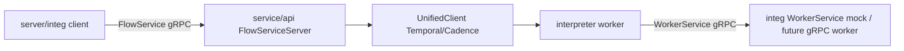

# Server rewrite onto iwf.proto

Detailed implementation plan for migrating the iWF Go server from the deleted
OpenAPI `gen/iwfidl` stubs onto the gRPC `iwf.proto` IDL.

- Rename source of truth: [`docs/design/idl-renames.md`](../idl-renames.md)
- Types: [`protos/iwf.proto`](../../../protos/iwf.proto) → [`server/gen/iwfpb`](../../../server/gen/iwfpb)



## Decisions (locked)

- **Transport:** Full gRPC. Replace Gin/`iwfidl` with a `FlowService` server; call
  workers via a `WorkerService` client. Delete OpenAPI HTTP routes and all
  `gen/iwfidl` usage under `server/`.
- **`WaitForStepCompletion` & `WaitForAttribute`:** implemented via **Temporal
  Synchronous Update** against the main interpreter workflow (interpreter update
  handlers that `Await` inside the workflow). **Cadence drops support** for both
  RPCs — they return gRPC `codes.Unimplemented`.
- **RPC locking:** re-add a minimal lock surface — `repeated string
  lock_attribute_keys` on `InvokeRPCRequest`. Non-empty → sync-update locking path
  over those keys; empty → non-locking. Keeps the retained
  `RPC_ACQUIRE_LOCK_FAILURE` + `skip_locking_rpc_reapply` meaningful. Because the
  locking path uses `SynchronousUpdateWorkflow`, a **non-empty `lock_attribute_keys`
  is Temporal-only** — Cadence returns `codes.Unimplemented`; non-locking RPC still
  works on Cadence via signal+query.
- **Global versioning:** reset the interpreter `GlobalVersioner` to v1 and keep the
  mechanism as a forward determinism hook (do not remove versioning).
- **Health:** implement both the IDL `HealthCheck` RPC and the standard
  `grpc.health.v1` service.
- **gRPC transport:** use plaintext gRPC targets in this phase. Reject HTTP(S)
  URLs rather than silently stripping their schemes. Forward configured default
  headers as outgoing gRPC metadata.
- **Stop COMPLETE:** `STOP_TYPE_COMPLETE` sends a system control signal that
  force-completes the interpreter successfully with its accumulated step results.
  It does not synthesize a step output.
- **Continue-as-new dump — proto, not JSON.** The CAN snapshot is currently
  `json.Marshal`ed (double serialization: already-encoded `Value`s re-wrapped in a
  JSON string, carried over HTTP + Temporal query, then `json.Unmarshal`ed). Replace
  with a proto `ContinueAsNewDump` message, transported as proto `bytes` pages over a
  **dedicated internal gRPC RPC** (`InternalService.DumpFlowForContinueAsNew`) that
  the CAN activity calls. `Value`s are serialized exactly once (as proto), never
  re-JSON-marshaled.
- **No compatibility:** Remove LoadingPolicy, DumpFlow public API, `waitForKey`,
  `WaitForStateCompletionMigration`, dual signal/internal APIs, `optimize_timer`,
  `useMemoForDataAttributes`, DeciderTriggerType dual path, worker-RPC
  `upsert_step_exe_locals`.
- **Memo is metadata, never attribute storage.** Fully delete the
  `useMemoForDataAttributes` feature and its config/interface/runtime plumbing. Keep
  only the legitimate backend memo uses: `WorkerTargetMemoKey`, workflow request-id
  idempotency, and the client memo encode/decode/encryption helpers serving those
  system keys. `iwf.proto` intentionally has no memo field.
- **SDK boundary:** SDK client/worker implementations are intentionally untouched.
  This phase makes `server/` + `server/integ` green; existing SDK implementations
  are expected to remain incompatible until their follow-up rewrite. Do not
  regenerate or modify SDK generated stubs in this phase.
- **Channel multi-consume:** Port *behavior* from
  [indeedeng/iwf#600](https://github.com/indeedeng/iwf/pull/600) only. Zero
  compatibility: no `value`+`multiValues` dual fields, no version/global-version
  branches, no "legacy Exact-1 ignores AtLeast/AtMost" path. Every
  `ChannelCondition` always honors `at_least`/`at_most`; results always use
  `repeated Value values`.
- **History / internal serializable payloads are proto (Phase 2.5):** Every value that
  Temporal or Cadence serializes into workflow history (workflow I/O, activity I/O,
  signals, sync updates, continue-as-new input) **and** every query/update handler
  request/response is a `proto.Message` defined in `iwf.proto` (server-internal
  section). Do not leave Go structs with nested `iwfpb` fields as the outer
  history type — that falls through to JSON and double-encodes `Value`s.
- **Binary protobuf DataConverter (Temporal + Cadence):** Both backends use a
  shared encoding policy: `proto.Message` → binary protobuf. Temporal uses a
  custom composite converter with `ProtoPayloadConverter` before the JSON escape
  hatch; there is no old-history `ProtoJSONPayloadConverter` compatibility path.
  Cadence uses a custom `encoded.DataConverter` instead of its default
  byte-slice/Thrift/JSON converter. API client and interpreter worker Options must
  use the same converter configuration and codec chain, not necessarily the same
  object instance.

### Supersedes earlier drafts

- WaitForAttribute is **not** an API-layer long-poll; it is an interpreter update
  handler (Temporal-only).
- "Event-driven WaitForAttribute inside interpreter" is **in scope** (Phase 4),
  not deferred.

## Current state / why sequencing matters

`protos/iwf.proto` + `server/gen/iwfpb` already exist with the full
Flow/Step/Condition IDL (`FlowService` + `WorkerService`). But the old OpenAPI
stubs `server/gen/iwfidl` are **already deleted**, while **129 `.go` files still
import them**, so the server does not compile:

```
$ go build ./...
config/config.go:29:2: no required module provides package .../gen/iwfidl
... + ambiguous genproto imports
```

The imports span `config/`, `service/api`, `service/interpreter/**`,
`service/client/**`, `service/common/**`, and all of `integ/`.

**Consequence:** there is no incremental green `go build` per file. The realistic
unit of compilability is the whole non-test tree (Phases 1–4 land together), then
tests (Phase 5), then replay (Phase 6). Do the work bottom-up so the final wiring
compiles in one pass:

`common (Value/mapper/errors/rpc) → service/interfaces+const → Phase 2.5
(internal serializable types + DataConverters) → client → interpreter → api → cmd →
integ`.

Treat Phases 1–4 (incl. 2.5) as workstreams in one source migration, not
independently mergeable releases. Use targeted build checkpoints after each
bottom-up slice; the first whole-server green checkpoint is after Phase 4:

```
cd server
go build ./service/common/...
go build ./service/client/... ./service/interpreter/...
go build ./config/... ./service/... ./cmd/server/...
```

Phase 5 is the first full repository test checkpoint. Do not add a compatibility
shim merely to make an intermediate commit green.

---

## Phase 0 — IDL contract (do first)

1. In [`protos/iwf.proto`](../../../protos/iwf.proto) `ChannelResult` (~line 578):
   replace `Value value = 4;` with `repeated Value values = 4;`.
2. Change `ChannelCondition.at_least` / `at_most` to `optional int32`; explicit
   `at_least=0` must be distinguishable from an omitted field.
3. Change `WaitForStepCompletionRequest` to require exactly one target:
   ```
   oneof target {
     string step_execution_id = 2;
     string step_type = 3;
   }
   ```
   Keep no `run_id`: the API targets the current run with an empty Temporal run id.
4. Rename `StartFlowRequest.worker_url` → `worker_target`; this is a plaintext gRPC
   dial target, not a URL.
5. In `InvokeRPCRequest` (~line 362) add the locking field:
   ```
   // Acquire exclusive lock on these attribute keys for the RPC's
   // read-modify-write. Empty = non-locking RPC.
   repeated string lock_attribute_keys = 6;
   ```
6. Add the **continue-as-new dump** proto surface (see "CAN dump" section below):
   a new `InternalService` with `DumpFlowForContinueAsNew`, the paging
   request/response, and the `ContinueAsNewDump` snapshot message + sub-messages.
7. Record in [`docs/design/idl-renames.md`](../idl-renames.md): append
   `ChannelResult.value → values (repeated)`, optional channel bounds,
   `worker_url → worker_target`, the wait target `oneof`, the new
   `InvokeRPCRequest.lock_attribute_keys` (replaces the old
   `PersistenceLoadingPolicy.LockingKeys`), and the `InternalService` /
   `ContinueAsNewDump` addition (replaces the JSON `WorkflowDumpRequest/Response`).
8. Add a server-only `proto-server-go` target in `protos/Makefile` and delegate to
   it from a matching `server/Makefile` target. Regenerate only
   `server/gen/iwfpb`; do not run the existing `proto-go` / `idl-code-gen` targets
   because they also rewrite SDK generated trees. Confirm the generated Go shows
   `Values []*Value`, optional bound presence, `LockAttributeKeys []string`, and
   the `InternalServiceServer` / `ContinueAsNewDump` types.

### CAN dump proto (Phase 0 IDL; wired in Phases 1/3/4)

Today the snapshot (`service.ContinueAsNewDumpResponse`) is `json.Marshal`ed whole,
sliced into byte pages carried as a JSON string field, returned through a Temporal
query + an HTTP call to the API service, then `json.Unmarshal`ed. The `Value`s inside
(attributes, channel data, step outputs) are already-encoded payloads, so they get
serialized twice. Replace with proto:

- New **internal** service (server↔server only; not SDK-facing), hosted on the same
  gRPC server/port as `FlowService`:
  ```
  service InternalService {
    rpc DumpFlowForContinueAsNew(ContinueAsNewDumpRequest) returns (ContinueAsNewDumpResponse);
  }

  message ContinueAsNewDumpRequest {
    string flow_id = 1;
    string run_id = 2;
    int32 page_num = 3;
    int32 page_size_in_bytes = 4;
  }

  message ContinueAsNewDumpResponse {
    bytes page_content = 1;   // a byte slice of the proto-marshaled ContinueAsNewDump
    int32 page_num = 2;
    int32 total_pages = 3;
    string checksum = 4;      // guards against the snapshot changing across pages
  }
  ```
- `ContinueAsNewDump` snapshot message, mapping 1:1 from
  `service.ContinueAsNewDumpResponse` onto the renamed proto types (all fields already
  `Value`-based → `GetSnapshot()` builds it with **no** conversion):
  - `repeated StepMovement steps_to_start_from_beginning`
  - `map<string, StepExecutionResumeInfo> step_executions_to_resume`
  - `map<string, ChannelValues> channel_received` (unified signal+internal;
    `ChannelValues { repeated Value values }`)
  - `StepExecutionCounterInfo counter_info`
  - `repeated StepCompletionOutput step_outputs` (the whitelisted retained
    completion markers used by WaitForStepCompletion)
  - `repeated StaleSkipTimer stale_skip_timers`
  - `repeated AttributeWrite attributes` (unified value + retained `IndexConfig`;
    deleted/null attributes are absent)
  - sub-messages `StepExecutionResumeInfo` (step_execution_id, `StepMovement`,
    completed conditions, `WaitingCondition`, step_exe_locals),
    `StepExecutionCounterInfo`, `StaleSkipTimer`.
- Paging stays (Temporal query result size limit): the query handler
  uses `proto.MarshalOptions{Deterministic: true}` on the whole
  `ContinueAsNewDump`; `checksum` = hash of those stable bytes. It returns the
  requested `page_size_in_bytes` slice as `page_content`. The activity concatenates
  pages and `proto.Unmarshal`s once.

**AtLeast/AtMost semantics** (implemented in Phase 4; fixed here as the contract),
always-on, no version gate:

- **Exact N:** `at_least=N, at_most=N` — wait until N available, consume exactly N.
- **OneToAll:** `at_least=1`, `at_most` unset/0 — wait for ≥1, then consume all
  currently available (capped only by queue size).
- **ZeroToAll:** `at_least=0`, `at_most` unset/0 — do not wait; consume all
  currently available (empty `values` + `COMPLETED` is valid).
- **Defaults:** both unset → Exact 1; only `at_most` set → Exact N
  (`at_least = at_most`); only `at_least` set → OneToAll / ZeroToAll as above.
- Reject invalid pairs when validating the untrusted `WorkerService` response
  (`at_least < 0`, `at_most < 0`, or
  `at_most > 0 && at_most < at_least`). The interpreter treats a post-validation
  violation as an invariant failure.
- Matching is two-phase: normalize/peek without mutation, deterministically choose
  the winning ALL/ANY/combination set while reserving shared-channel capacity, then
  atomically consume the selected conditions in declaration order. Never consume a
  message for a condition that does not participate in the winning trigger.

---

## Phase 1 — Build unblock + bootstrap + gRPC API shell

### 1a. Dependency graph (prerequisite — nothing compiles without this)

- Do **not** run `go mod tidy` while deleted `gen/iwfidl` imports remain; it cannot
  resolve the broken source graph. Keep the existing explicit
  `google.golang.org/genproto/googleapis/{api,rpc}`, `grpc v1.79.3`, and
  `protobuf v1.36.11` requirements during the source migration.
- After Phase 5 removes the old imports, use `go mod why -m` / `go mod graph` to
  identify the exact legacy monolithic `genproto` importer, then run
  `go mod tidy`. Do not blindly pin around an unknown import chain.
- Remove `github.com/gin-gonic/gin` (+ `gin-contrib/sse`) from `require` once no
  code imports it (after Phase 5).
- Verify at end of Phase 5: `rg -l 'gen/iwfidl' server --glob '*.go'` returns empty.

### 1b. `server/config/config.go`

- `ApiConfig.Port`: keep YAML key `port`; default 8801. Document the gRPC protocol,
  bind behavior, and which clients connect.
- Document `ApiConfig.MaxWaitSeconds` completely: zero uses the 60-second default;
  positive values set the cap; negatives are invalid. It caps both synchronous
  wait RPCs and `WaitForFlow`.
- Add `ApiConfig.GrpcMaxMessageBytes` (default 16 MiB, positive): applies to
  FlowService/InternalService server and clients and must exceed a CAN dump page
  plus protobuf overhead.
- **Delete** `WaitForStateCompletionMigration` struct, its `ApiConfig` field, and
  the `GetSignalWithStartOnWithDefault` / `GetWaitForOnWithDefault` helpers.
- **Delete** `Interpreter.FailAtMemoIncompatibility`; it guarded only the removed
  memo-as-data-attribute path.
- Retype `Interpreter.DefaultWorkflowConfig` `*iwfidl.WorkflowConfig` →
  `*iwfpb.FlowConfig`; update the `DefaultWorkflowConfig` package var
  (`ContinueAsNewThreshold: 100`).
- `DumpWorkflowInternalActivityConfig.RetryPolicy`: `*iwfidl.RetryPolicy` →
  `*iwfpb.RetryPolicy`.
- Rename `InterpreterActivityConfig.ApiServiceAddress` →
  `InternalServiceTarget` and its helper accordingly. Use YAML key
  `internalServiceTarget`; default `localhost:<Api.Port>`. Document that the
  interpreter activity dials the plaintext internal gRPC service on the API bind
  port.
- Add documented `InterpreterActivityConfig` pool tunables:
  `WorkerConnectionIdleTimeout` (default 10 minutes) and
  `MaxWorkerConnections` (default 1000, positive). The pool evicts only idle,
  unreferenced connections; if all slots are active, fail the worker call rather
  than closing an in-flight connection.
- Because `server/config/config.go` is edited, bring every config struct field in
  that file into compliance: document its default, operational meaning, valid
  range, and relationships required by the repository config rules.

### 1c. Bootstrap `server/cmd/server/iwf/iwf.go`

- Replace the API branch (`api.NewService(...).Run(":port")`, an `http.Server`)
  with a `grpc.NewServer` configured with panic-recovery, structured logging,
  and metrics unary interceptors plus message-size server options; register
  `iwfpb.RegisterFlowServiceServer(grpcServer, flowServer)`,
  `iwfpb.RegisterInternalServiceServer(grpcServer, internalServer)` (CAN dump; same
  server/port), `net.Listen("tcp", ":Api.Port")`, `grpcServer.Serve(lis)`.
- Register health (implement IDL `HealthCheck` **and** `grpc/health`). Both report
  not-serving until the listener is bound and the configured Temporal/Cadence
  backend health check succeeds; use the same readiness source for both surfaces.
- Bump `grpc.MaxRecvMsgSize`/`MaxSendMsgSize` on server and CAN-activity client to
  `ApiConfig.GrpcMaxMessageBytes`; apply the same limit to WorkerService clients.
- On process shutdown, mark health not-serving, call `GracefulStop` with a bounded
  fallback to `Stop`, close InternalService/WorkerService connection pools, and
  stop the Temporal/Cadence workers and backend clients.
- Once the Phase 2.5 factories exist, construct the selected backend converter
  configuration before dialing the Temporal/Cadence client. Set the backend
  `client.Options.DataConverter` here and constructor-inject the matching converter
  into the interpreter worker; do not reconstruct converter order in bootstrap.
- Interpreter-worker launch (`temporal.NewInterpreterWorker` /
  `cadence.NewInterpreterWorker`) otherwise changes only for transitive config/type
  retypes and the required converter dependency.

### 1d. Replace `server/service/api/`

- **Delete** `routers.go` and Gin `handler.go`.
- `interfaces.go` + `service.go`: `serviceImpl` implements the generated
  `iwfpb.FlowServiceServer` (embed `iwfpb.UnimplementedFlowServiceServer`). Method
  mapping (old handler → new RPC):

  | Old handler | New RPC | Notes |
  |---|---|---|
  | `ApiV1WorkflowStartPost` | `StartFlow` | worker_target→Memo, requestId idempotency kept; **drop** `useMemoForDataAttributes`; SA/DA split → unified `attributes` + `IndexConfig` |
  | `ApiV1WorkflowSignalPost` + `ApiV1WorkflowPublishToInternalChannelPost` | `PublishToChannel` | one system signal carrying `[]ChannelMessage` |
  | `ApiV1WorkflowStopPost` | `StopFlow` | `COMPLETE` sends the successful force-complete system signal described below |
  | `ApiV1WorkflowGetQueryAttributesPost` + `ApiV1WorkflowGetSearchAttributesPost` | `GetAttributes` | single store; `all_keys` flag; never read attributes from backend Memo |
  | `ApiV1WorkflowSetQueryAttributesPost` + `ApiV1WorkflowSetSearchAttributesPost` | `SetAttributes` | `AttributeWrite` w/ `IndexConfig` |
  | `ApiV1WorkflowGetPost` + `ApiV1WorkflowGetWithWaitPost` | `WaitForFlow` | Describe-first; zero wait returns status immediately, positive wait may call `GetWorkflowResult` |
  | `ApiV1WorkflowSearchPost` | `SearchFlows` | |
  | `ApiV1WorkflowRpcPost` | `InvokeRPC` | locking via `lock_attribute_keys` (see below) |
  | `ApiV1WorkflowResetPost` | `ResetFlow` | |
  | `ApiV1WorkflowSkipTimerPost` | `SkipTimer` | |
  | `ApiV1WorkflowConfigUpdate` | `UpdateFlowConfig` | |
  | `ApiV1WorkflowWaitForStateCompletion` | `WaitForStepCompletion` | **sync update, Temporal-only** (see below) |
  | `ApiV1WorkflowTriggerContinueAsNew` | `TriggerContinueAsNew` | |
  | `ApiInfoHealth` | `HealthCheck` | |
  | *(new)* | `LoadBlobs` | thin wrapper over [`blobstore`](../../../server/service/common/blobstore) |
  | *(new)* | `WaitForAttribute` | **sync update, Temporal-only** (see below) |
  | `ApiV1WorkflowDumpPost` | **removed from FlowService** | replaced by `InternalService.DumpFlowForContinueAsNew` (proto bytes pages); the public DumpFlow API is gone |

- Construct API and transport components with constructor injection. Pass
  `*config.ApiConfig`, `*config.ExternalStorageConfig`, and
  `*config.InterpreterActivityConfig` sections only to components that need them;
  do not pass `config.Config` or individual tunables. Constructors panic on nil
  required sections. Do not add setter injection.

- **Error mapping:** replace HTTP status translation with an explicit gRPC table:

  | Condition | gRPC code |
  |---|---|
  | malformed request/value/worker response | `InvalidArgument` |
  | flow already exists | `AlreadyExists` |
  | flow/run does not exist | `NotFound` |
  | flow is closed or operation is invalid for its state | `FailedPrecondition` |
  | RPC attribute lock contention | `Aborted` |
  | connection-pool capacity or gRPC message limit exceeded | `ResourceExhausted` |
  | wait exceeds its effective deadline | `DeadlineExceeded` |
  | caller cancels | `Canceled` |
  | Temporal/Cadence/worker transport unavailable | `Unavailable` |
  | violated trusted invariant or unexpected failure | `Internal` |

  Attach `iwfpb.ErrorResponse` via `status.WithDetails`, preserving
  `ErrorSubStatus`. WorkerService failures attach `iwfpb.WorkerErrorResponse`; the
  server copies its detail/type and the numeric gRPC worker code into
  `original_worker_error_*`. Add helpers in
  [`service/common/errors`](../../../server/service/common/errors), remove the
  `HttpStatusCodeSpecial4xx*` sentinels, and cover detail round-trips in integ.

- **`StartFlow` specifics:** keep `worker_target` in Memo
  (`service.WorkerTargetMemoKey`) — still the dial target; keep `requestId` memo
  idempotency for `ignore_already_started`. Delete the whole `useMemoForDAs` block:
  do not write a feature-flag memo key or copy each data attribute into Memo. Delete
  `service.UseMemoForDataAttributesKey`. `GetAttributes` deletes
  `GetUseMemoForDataAttributes`, the `response.Memos` attribute-read branch, and its
  incompatibility check. External-storage large-input offload stays but writes blob
  ids onto `Value` (Phase 2 value model), not
  `EncodedObject.ExtStoreId/ExtPath`.

**`StopFlow(COMPLETE)`:**
- Send a new `CompleteFlowSignalChannelName` system signal to the interpreter on
  both Temporal and Cadence.
- The main interpreter loop cancels/drains waiting condition threads, preserves
  already accumulated `StepCompletionOutput`s, and returns a successful
  `InterpreterWorkflowOutput`. `reason` is logged/evented but is not a step output.
- Do not synthesize completion for an in-flight step. A closed flow returns
  `FailedPrecondition`.

**`WaitForStepCompletion` (sync update, Temporal-only):**
- If backend is Cadence → return `codes.Unimplemented`
  ("WaitForStepCompletion requires Temporal synchronous update").
- Else `client.SynchronousUpdateWorkflow(ctx, &out, flowId, "",
  service.WaitForStepCompletionUpdateType, req)` against the **main interpreter
  workflow`. There is no `run_id` in this API: the empty client run id targets the
  current run, while the handler resolves completion from the
  `step_execution_id`/`step_type` indexes restored across continue-as-new. Pass the
  target + capped deadline
  (`min(wait_time_seconds, Api.MaxWaitSeconds)`). Result → `WaitForStepCompletionResponse`.
  Workflow-side timeout → `DeadlineExceeded` + `LONG_POLL_TIME_OUT`.
- Require exactly one target through the Phase 0 `oneof`.
  `step_execution_id` returns that exact completion. For `step_type`, bind the
  target to that type's first-started monotonic execution id and wait for that exact
  execution; a later execution cannot win by finishing first. An already retained
  completion returns immediately.
- Reject negative `wait_time_seconds`; zero performs an immediate retained-state
  check, and a positive value is capped by `Api.MaxWaitSeconds`.
- `StartFlow.wait_for_completion_step_execution_ids` /
  `wait_for_completion_step_types` are the retention whitelist. Retain completion
  markers (including a nil output) only for registered targets, restore them across
  CAN, and return `FailedPrecondition` when waiting on an unregistered target. This
  prevents an unbounded all-step completion map.
- **Delete** the old separate-system-workflow path
  (`StartWaitForStateCompletionWorkflow` + `GetWorkflowResult` on a system workflow,
  the `waitForOn` old/new branch, `GetWorkflowIdForWaitForStateExecution`).

**`WaitForAttribute` (sync update, Temporal-only):**
- If backend is Cadence → `codes.Unimplemented`.
- Require a condition, a non-empty key, and an explicitly present `Value`. A
  missing value is invalid; explicit `null_value` means missing/absent.
- Reject negative `wait_time_seconds`; zero performs one immediate comparison, and
  a positive value is capped by `Api.MaxWaitSeconds`.
- Else `SynchronousUpdateWorkflow(..., service.WaitForAttributeUpdateType,
  {condition, deadline})`. The handler awaits until `WaitForAttributeEqual` matches
  (typed `Value` compare, hydrating blob arms) or the deadline timer fires.
  Missing and `null_value` are equivalent. Compare `obj_value` by exact
  `encoding` + serialized `payload` bytes; the server does not deserialize objects
  for semantic equality. Match → `Empty`; timeout → `DeadlineExceeded`.
- The client waits on the caller context (`handle.Get(ctx, ...)`), never
  `context.Background()`. Caller cancellation returns `Canceled`; Temporal does not
  cancel an accepted workflow update, so the read-only handler remains bounded by
  its workflow-side capped deadline.

Add an API pre-check: when `client.GetBackendType() == BackendTypeCadence`,
short-circuit these two RPCs — and any `InvokeRPC` with non-empty
`lock_attribute_keys` — to `Unimplemented` before dialing.

**RPC locking (`InvokeRPC`):** driven by the new `InvokeRPCRequest.lock_attribute_keys`
(Phase 0). When non-empty, run the synchronous-update locking path and atomically
`TryLockKeys(sortedUniqueKeys)`; when empty, run the non-locking path. The validator
returns `RPC_ACQUIRE_LOCK_FAILURE` / `Aborted` when any requested key is locked; the
handler acquires all keys before its first yield and releases them with `defer` on
every path. It never waits while partially holding keys. A locking worker response
may write only keys in its normalized lock set; queue any non-owner step/signal
result touching those keys and apply its whole side-effect batch after unlock. This
replaces the old
`PersistenceLoadingPolicy.LockingKeys` surface; partial-loading types are gone (we
always load all attributes).

---

## Phase 2 — Shared types + UnifiedClient

- [`server/service/interfaces.go`](../../../server/service/interfaces.go) +
  [`const.go`](../../../server/service/const.go): **interim** retype of interpreter
  input/output Go structs (`InterpreterWorkflowInput/Output`,
  `ExecuteRpcSignalRequest`, etc.) to nested `iwfpb` fields + Flow/Step/Condition
  names, including `IwfWorkerUrl` → `WorkerTarget`. Drop HTTP worker-path constants
  (`StateStartApi`, `StateDecideApi`, `WorkflowWorkerRpcApi`). **Keep** the system
  signal/query channel-name constants (`ExecuteRpcSignalChannelName`,
  `UpdateConfigSignalChannelName`, `FailWorkflowSignalChannelName`,
  `SkipTimerSignalChannelName`, `TriggerContinueAsNewSignalChannelName`, query
  types) — string names stay in Go; the **payload messages** move to proto in
  Phase 2.5. Add update-type constants `WaitForStepCompletionUpdateType`,
  `WaitForAttributeUpdateType` next to `ExecuteOptimisticLockingRpcUpdateType`.
  Phase 2.5 replaces the remaining Go internal serializable structs with `iwfpb`
  messages. Delete `InterpreterWorkflowInput.UseMemoForDataAttributes` from any
  interim Go struct and every constructor/call site; the Phase 2.5 proto
  intentionally has no replacement field.
- [`server/service/client/interfaces.go`](../../../server/service/client/interfaces.go)
  + `temporal/` + `cadence/`: retype `UnifiedClient` and both impls to `iwfpb`
  names (`flow_id`, `run_id`, unified attributes, channel publish,
  `ResetFlowRequest` incl. renamed `STEP_TYPE`/`STEP_EXECUTION_ID`).
  - **Delete** `StartWaitForStateCompletionWorkflow`,
    `SignalWithStartWaitForStateCompletionWorkflow`,
    `service.WaitForStateCompletionWorkflowOutput`, and
    `GetWorkflowIdForWaitForStateExecution`.
  - **Keep** `SynchronousUpdateWorkflow` (Cadence stays `not supported in Cadence`)
    and `GetWorkflowResult` (used by `WaitForFlow`). Temporal
    `SynchronousUpdateWorkflow` must call `handle.Get(ctx, valuePtr)` so caller
    cancellation and deadlines propagate.
- [`service/common/compatibility`](../../../server/service/common/compatibility):
  **delete** `commandRequest.go`, `stateOptions.go`, `workflowStartOptions.go`; fold
  any residual single-field mapping into callers.
- [`service/common/mapper/searchAttribute.go`](../../../server/service/common/mapper):
  map `AttributeWrite`/`Value` ↔ Temporal/Cadence search-attribute encoding, driven
  by `IndexConfig` + type inference from the `Value` oneof. Delete `SearchAttribute*`
  paths.
- **Value model** (touches `common/blobstore/helpers.go`, `common/rpc`,
  `common/utils`, api external-storage code): replace old
  `EncodedObject{Data/ExtStoreId/ExtPath/Encoding}` string paths with the `Value`
  oneof (`string_value`/`obj_value`/scalars/`null_value`) plus the two
  `internal_blob_id_for_*` arms. External-storage threshold writes a blob id onto the
  `Value` arm; hydration replaces the blob-id arm with the concrete arm.
  `EncodedObject` is now strictly `encoding + payload bytes`. An
  `AttributeWrite` with `null_value` deletes the key from the persistence map
  instead of storing a null entry, removes its indexed value when applicable, and
  ignores the write's `IndexConfig`; existing stored index metadata drives cleanup.
  Consequently, missing and null are the same observable attribute state.
  A missing `AttributeWrite.value` is invalid and is not deletion.
- **Blob-id trust boundary:** only the server mints
  `internal_blob_id_for_*`. Reject those arms on external FlowService inputs and
  WorkerService responses; workers return concrete values and the server performs
  threshold offload afterward. `LoadBlobs` is the only public operation that
  accepts server-minted blob ids.

---

## Phase 2.5 — Internal serializable types + DataConverters

**Goal:** Everything Temporal/Cadence serializes for the interpreter (history and
query/update internal serializable payloads) is a top-level `proto.Message`, encoded as **binary
protobuf** on both backends. Stop JSON-wrapping Go structs that nest `iwfpb`
fields.

**Scope / non-goals:**

- This phase delivers two things: (a) the server-internal proto messages, and (b) the
  converter **factory functions**. The actual `Options.DataConverter = …` wiring lands
  where the Options are built — `cmd/server` (Phase 1c), the interpreter workers
  (Phase 4), and integ (Phase 5). Phase 2.5 alone is **not** independently green (the
  worker Options can't be wired until Phase 4 compiles); see the checkpoint.
- **Search-attribute values are out of scope.** SA values are typed through Temporal's
  visibility / SA encoding (the `mapper`), **not** our `PayloadConverter`. Do not route
  SA encoding through the proto converter or expect binary there.
- **In-process-only structs are out of scope.** `IwfEvent` / `event.Handle`, metric
  tags, and similar are never serialized to history — they get retyped off `iwfidl` in
  Phase 2/4 but do **not** become proto messages.
- **No global message registry.** Both SDKs decode into the target's concrete type from
  the call signature (Temporal per-arg; Cadence `FromData(to ...interface{})`), so no
  message-name → type registry is needed.

### IDL (`protos/iwf.proto`)

Add an **Internal serializable types** section (same spirit as
`ContinueAsNewDump` / `InternalService` — not FlowService public RPCs). Select
messages by a **serialization-boundary inventory**, not by which Go file currently
contains a struct. Complete this table before assigning fields:

| Boundary | Required top-level proto (names indicative) | Notes |
|----------|----------------------------------------------|-------|
| Interpreter workflow | `InterpreterWorkflowInput`, `InterpreterWorkflowOutput`, `ContinueAsNewInput` | Includes start, result, and continue-as-new input. |
| Server maintenance workflows | `BlobStoreCleanupWorkflowInput`/`Output` | Do not leave the cleanup workflow as primitive `string`/`int` I/O. |
| Worker-method activities | `InvokeWaitForMethodActivityInput`/`Output`, `InvokeExecuteMethodActivityInput`/`Output` | One input message and one output message per activity. |
| Internal/RPC/cleanup activities | `DumpFlowForContinueAsNewActivityInput`/`Output`, `InvokeWorkerRPCActivityInput`/`Output`, `CleanupBlobStoreActivityInput`/`Output` | Eliminate `backendType, request, ...` multi-arg call sites. Reuse existing request/response messages as nested fields where possible. |
| Signals | `ExecuteRpcSignalRequest`, `SkipTimerSignalRequest`, `FailFlowSignalRequest`, `CompleteFlowSignalRequest` | Reuse `FlowConfig` directly for the config-update signal. |
| Queries | `GetAttributesQueryRequest`/`Response`, `PrepareRpcQueryRequest`/`Response`, `GetCurrentTimerInfosQueryResponse`, `GetScheduledGreedyTimerTimesQueryResponse`, `DebugDumpResponse` | Every handler argument and result is a proto pointer. |
| Synchronous updates | Reuse public wait/RPC request/response messages | Prefer returning the public response plus a Go error. Add an internal result envelope only if response/error multiplexing remains necessary. |
| Nested timer/status data | `TimerInfo`, `InternalTimerStatus` | These become proto only because a serialized query/snapshot contains them. |
| Serialized failures | `InterpreterError` or equivalent | Preserve the gRPC code and `ErrorResponse` currently carried by `ErrorAndStatus`; never JSON-wrap it inside an activity/update result. |

The inventory must cover exported structs outside
[`server/service/interfaces.go`](../../../server/service/interfaces.go), especially
activity/update results currently under `service/interpreter/interfaces`. Conversely,
in-process helpers such as `BasicInfo` remain Go structs. Do not create a proto enum
for an unused/internal `StepExecutionStatus` unless the completed inventory shows a
real serialization boundary.

Proto schema rules for this section:

- All call sites pass generated messages by pointer so they implement
  `proto.Message`.
- Every new enum reserves `*_UNSPECIFIED = 0`; decode paths reject unspecified
  values where absence is invalid.
- Proto maps cannot directly contain repeated values. Represent
  `map<string, []*TimerInfo>` as `map<string, TimerInfoList>` or as repeated keyed
  entries; do not flatten or lose the step-execution key.
- Do not add a message-name → Go-type registry. Both SDKs decode into the concrete
  target type supplied by the function signature.

Regen server stubs only: `make -C protos proto-server-go` +
`make -C server idl-code-gen-server`. Do **not** regen SDKs.

After the Phase 4 call-site migration, `interfaces.go` retains only in-process
helpers (e.g. `BasicInfo`, `ValidateTimerSkipRequest`) and temporary type aliases
needed during the rename. Delete every Go struct that became a proto message.
Signal/query/update **name** constants stay in `const.go`.

### Temporal DataConverter

Provide a shared factory (e.g. `service/common/converter` or under
`service/client/temporal`):

```go
converter.NewCompositeDataConverter(
  converter.NewNilPayloadConverter(),
  converter.NewByteSlicePayloadConverter(),
  converter.NewProtoPayloadConverter(),       // binary first — storage efficiency
  converter.NewJSONPayloadConverter(),        // non-proto SDK/primitive escape hatch
)
```

`NewJSONPayloadConverter` remains because the SDK converter is process-wide and
must still handle legitimate non-proto primitive values. It is **not** a
compatibility mechanism. The boundary inventory, typed call-site checks, and
raw-history/raw-query assertions must prove that no interpreter
workflow/activity/signal/query/update outer payload uses `json/plain`.

Wiring contract (implemented where each Options value is constructed):

- Temporal API `client.Options.DataConverter` (`cmd/server` in Phase 1c and integ
  helpers in Phase 5).
- Interpreter Temporal `worker.Options.DataConverter` in Phase 4.
- **Memo encode/decode:** WorkerTarget and RequestId memos pass through the backend
  client converter. The matching converter must serve StartFlow's RequestId
  idempotency check and every memo read via `DescribeWorkflowExecution`; neither
  Temporal nor Cadence may retain a default-converter read path.
- Memo-encryption path: wrap this converter with the existing codec converter
  (`converter.NewCodecDataConverter(base, codec)`) on Temporal only. Construct the
  wrapper once per client/worker configuration, avoid the current double wrapping,
  and do not fall back to `GetDefaultDataConverter()` for interpreter payloads.
- Reset and replay decode with the same configuration/codec chain. Search attributes
  explicitly continue through the backend-native mapper and converter.

### Cadence DataConverter

Cadence's default `encoded.DataConverter` passes a single `[]byte` through unchanged,
uses Thrift where applicable, and otherwise uses JSON. Implement a custom converter
with an exact, versioned wire format:

1. Preserve the default single-`[]byte` raw passthrough. A `[]byte` inside a
   multi-argument payload uses an explicit raw-bytes frame.
2. For a non-nil argument implementing `proto.Message`, marshal binary protobuf.
   Decode only into a concrete proto pointer supplied to `FromData`.
3. Otherwise use JSON as a non-proto SDK/primitive escape hatch. No interpreter
   Internal serializable outer payload may use this frame kind after Phase 4.
4. Frame multi-argument payloads as:
   `magic("IWFDC") + version(uint8) + frame_count(uint32 BE) + frames`. Each frame
   contains `kind(uint8: proto/json/raw) + nil(uint8) + length(uint32 BE) + data`.
   Reject an unknown magic/version/kind, impossible declared length, truncation,
   trailing bytes, and argument-count mismatch. Check lengths against the remaining
   input before allocating.
5. A typed nil proto pointer is encoded as a nil proto frame; it must not silently
   become JSON `null`.

All iWF interpreter call sites use exactly one top-level proto input and one
top-level proto result. The generic multi-arg framing remains necessary to satisfy
Cadence's variadic `DataConverter` contract and legitimate SDK values, not as an
excuse to retain interpreter multi-arg calls.

Wiring contract:

- Cadence `client.Options.DataConverter` in `cmd/server` Phase 1c and integ Phase 5.
- Interpreter Cadence `worker.Options.DataConverter` in Phase 4.
- Reset, query-result, failure-detail, and memo decode paths use the matching
  converter; remove direct `encoded.GetDefaultDataConverter()` calls.

### Deferred wiring / call-site contract

Phase 2.5 defines and generates every message in the boundary inventory and provides
tested Temporal/Cadence converter factories. It does not claim that current
interpreter call sites are already migrated.

Phase 4 must point interpreter + UnifiedClient
start/signal/query/update/activity/continue-as-new paths at those `iwfpb` messages,
replace remaining `json.Marshal` of internal serializable snapshots with proto marshal, and
remove the superseded Go payload structs. Phase 1c/4/5 must use the factory rather
than reconstructing converter order independently.

**Deterministic marshaling where bytes are compared.** `proto.Marshal` does not order
map keys deterministically, and `ContinueAsNewDump` has map fields (`channel_received`,
`step_executions_to_resume`). Any place that marshals to compare/checksum bytes — in
particular the CAN dump cross-page `checksum` guard, which an activity retry can
re-marshal — must use `proto.MarshalOptions{Deterministic: true}`, or the
checksum-mismatch reset loop can trip spuriously.

### Checkpoint

```
make -C protos proto-server-go
make -C server idl-code-gen-server
GOWORK=off go test -v ./service/common/converter/... 2>&1 | tee /tmp/test-converters.log
cd server && go build ./service/common/converter/... ./gen/iwfpb/...
```

Run the converter package tests directly while the full server remains uncompilable
(covered by `unitTests` once that target is green). Client/interpreter package
compilation and complete wiring are Phase 1c/4 exit gates, not a Phase 2.5 claim.

Stop for review after Phase 2.5 before Phase 3.

### Tests

- **Converter unit tests in Phase 2.5:**
  - Temporal proto payload metadata is `binary/protobuf`; nil, `[]byte`, map/oneof,
    and JSON-escape values round-trip. Assert a representative non-proto
    internal serializable Go struct would become `json/plain` so the Phase 5 raw-history test
    can detect an inventory miss.
  - Cadence single proto, multiple frames, mixed proto/JSON/raw, single raw
    `[]byte`, typed nil proto, and map/oneof messages round-trip.
  - Cadence rejects bad magic/version/kind, truncated header/data, oversized declared
    length, wrong arity, and trailing bytes without panicking or over-allocating.
- **Phase 5 integration assertions:** start → signal/query/update → activity on both
  backends. Inspect raw history for recorded workflow/activity/signal/update
  boundaries, and inspect raw query values or use a recording converter for query
  request/results. Temporal application payloads must have `binary/protobuf` metadata
  (or decode through the configured codec to that metadata); Cadence application
  payloads must have an `IWFDC` proto frame. The test must fail if an Internal
  serializable outer payload used JSON.
- Cover workflow memo write/read on both backends and Temporal memo encryption,
  including StartFlow RequestId idempotency and `DescribeWorkflowExecution`.
- Exercise reset/history decoding with the configured converter rather than a
  default-converter fallback.
- Phase 6 replay re-capture is required after binary encoding (old JSON histories
  are invalid regardless).

### Documentation

- Plan (this section) + short note in `server/CONTRIBUTING.md` / `server/README.md`:
  binary protobuf DataConverter on Temporal and Cadence; Web UI readability of
  binary payloads is degraded by design.
- [`docs/design/idl-renames.md`](../idl-renames.md): list the new internal
  Internal serializable type names.

### UI/UX

- N/A: no in-repo web UI. (Temporal Web may show opaque binary payloads.)

---

## Phase 3 — Worker client (activities / RPC)

- [`service/interpreter/activityImpl.go`](../../../server/service/interpreter/activityImpl.go)
  + [`service/common/rpc/invoke.go`](../../../server/service/common/rpc/invoke.go):
  replace `iwfidl.APIClient` (HTTP) with `iwfpb.WorkerServiceClient` (gRPC).
  Add a constructor-injected `workerClientPool` keyed by normalized worker target;
  inject the dialer so tests can supply `bufconn`. The pool uses a mutex/singleflight
  creation path, reference counts active users, evicts only idle connections using
  the Phase 1b limits, and exposes `Close()` for shutdown.
- Activity → RPC mapping: WaitUntil → `InvokeWaitForMethod`, Execute →
  `InvokeExecuteMethod`, worker RPC → `InvokeWorkerRPC` (response has **no**
  `upsert_step_exe_locals`).
- Replace [`service/common/urlautofix`](../../../server/service/common/urlautofix)
  with [`service/common/grpctarget`](../../../server/service/common/grpctarget). Accept
  `host:port` and documented native gRPC target forms, reject HTTP(S) URLs, and use
  `insecure.NewCredentials()` for this plaintext-only phase.
  `StartFlowRequest.worker_target` is the dial target.
- Convert `InterpreterActivityConfig.DefaultHeaders` to outgoing gRPC metadata for
  every WorkerService and InternalService call. Preserve each configured string
  value exactly and reject invalid metadata keys at startup.
- Apply `ApiConfig.GrpcMaxMessageBytes` to send/receive options for WorkerService
  and InternalService clients.
- **Always pass full attributes** — remove all LoadingPolicy plumbing from the
  activity request builders. Hydrate blob arms before the worker call when concrete
  values are needed. Worker responses must contain concrete values; validate them
  before applying any mutation.
- **`DumpWorkflowInternal` activity** (`activityImpl.go:573`): replace the
  `iwfidl.APIClient` HTTP call to `ApiV1WorkflowInternalDumpPost` with a gRPC
  `iwfpb.InternalServiceClient.DumpFlowForContinueAsNew` call (dial the API service
  target from config — Phase 1b). Own and close the single reusable internal
  connection. Return proto
  `ContinueAsNewDumpResponse` pages; no JSON.

---

## Phase 4 — Interpreter rewrite (core)

Primary files:
[`workflowImpl.go`](../../../server/service/interpreter/workflowImpl.go),
[`persistence.go`](../../../server/service/interpreter/persistence.go),
[`signalReceiver.go`](../../../server/service/interpreter/signalReceiver.go),
[`InternalChannel.go`](../../../server/service/interpreter/InternalChannel.go),
[`deciderTriggerer.go`](../../../server/service/interpreter/deciderTriggerer.go),
[`workflowUpdater.go`](../../../server/service/interpreter/workflowUpdater.go),
[`stateExecutionCounter.go`](../../../server/service/interpreter/stateExecutionCounter.go),
[`stateRequest.go`](../../../server/service/interpreter/stateRequest.go)/[`stateRequestQueue.go`](../../../server/service/interpreter/stateRequestQueue.go),
[`continueAsNewer.go`](../../../server/service/interpreter/continueAsNewer.go),
[`queryHandler.go`](../../../server/service/interpreter/queryHandler.go),
[`outputCollector.go`](../../../server/service/interpreter/outputCollector.go),
`timers/`, `config/workflowConfiger.go`, `interfaces/` (+ regenerate
`interfaces_mock.go`).

**Internal serializable types migration (Phase 2.5 contract):**

- Retype every start/signal/query/update/activity/continue-as-new call identified by
  the boundary inventory to a single top-level `*iwfpb.Message` argument/result.
  Delete the superseded Go payload structs, including serialized activity/update
  results outside `service/interfaces.go`; retain in-process helpers such as
  `BasicInfo`.
- Constructor-inject the Phase 2.5 converter into each interpreter worker and assign
  it to `worker.Options.DataConverter`. Reset/history decode paths receive that same
  converter configuration. No interpreter path calls either SDK's default converter.
- Keep search-attribute mapping backend-native. It does not pass through the
  Internal serializable types DataConverter.
- After migration, inspect every Cadence `ExecuteActivity`/`ExecuteLocalActivity`
  call: no iWF activity may retain variadic `backendType, request, ...` arguments.

Behavioral cleanups:

| Area | Change |
|------|--------|
| Naming | Workflow→Flow, State→Step, Command→Condition (`WaitingCondition`, `TimerCondition`, `ChannelCondition`, `ConditionResults`, `ConditionStatus`) |
| Channels | Unify signal + internal into one channel store; `PublishToChannel` / `channel_infos`; always-on AtLeast/AtMost multi-consume → `ChannelResult.values` (PR #600 algorithm only; delete single-message/version-gated paths) |
| Attributes | Single attribute store; indexed subset via `IndexConfig`; drop LoadingPolicy branches and memo-for-DA path |
| Config | `step_durability` SYNC/ASYNC; always greedy/optimized timers; delete `optimize_timer` |
| Wait-for-step | Drop `waitForKey`; wait only by `step_execution_id` / `step_type` |
| Conditional close | `*_ON_CHANNELS_EMPTY` + `channel_names` repeated |
| Options | Only `wait_for_*` / `execute_*` on `StepOptions` |
| RPC invoke | Remove loading policies; `lock_attribute_keys` is the only explicit lock surface |

**Delete memo-as-attribute storage completely:**

- Remove `WorkflowProvider.UpsertMemo`, its Temporal/Cadence implementations, the
  generated mock method, and test-provider stubs. Its only caller is the deleted
  attribute-storage branch.
- Remove `PersistenceManager.useMemo`, all constructor/rebuild parameters, and the
  `ProcessUpsertDataAttribute` branch that builds a memo map and calls
  `UpsertMemo`. Unified attribute writes update persistence/index state only.
- Remove `input.UseMemoForDataAttributes` from initial and CAN-restore
  `PersistenceManager` construction in `workflowImpl.go`.
- Do not pass memo-encryption flags/converters into interpreter workers for this
  feature. Legitimate `WorkerTargetMemoKey` and workflow request-id Memo
  encode/decode/encryption stays in the backend client/bootstrap path.

**Channels:** `InternalChannel` becomes the single unified store (rename →
`Channel`/`channelStore`), `receivedData map[string][]*iwfpb.Value`. Implement
the Phase 0 two-phase reservation/consume algorithm; a per-condition
`Consume(name, atLeast, atMost)` alone is insufficient when multiple conditions
share a channel. `GetInfos()` → `map[string]*iwfpb.ChannelInfo`. Matching lives in
`deciderTriggerer.go`; results emitted as `ChannelResult.values` in FIFO order.
Delete the single-message `Retrieve` / version-gated path.

**Signal vs channel split (important):** `signalReceiver.go` still receives *system*
signals (RPC exec, config update, fail, skip-timer, trigger-CAN, publish) — this is
system-signal transport, not the user "Channel" concept. `PublishToChannel`
payloads route into the unified channel store.

**Sync-update wait handlers (new — Temporal-only):**
- The existing `provider.SetRpcUpdateHandler` is hard-coded to the old
  `WorkflowRpcRequest`. Split a Temporal-only `UpdateProvider` from the common
  provider and add strongly typed registration methods for InvokeRPC,
  WaitForStepCompletion, and WaitForAttribute. Cadence does not implement this
  capability; do not add no-op methods. Regenerate `interfaces_mock.go`.
- Add `AwaitWithTimeout(ctx, duration, condition)` to the Temporal-only
  `UpdateProvider` rather than composing an unread `NewTimer` with `Await`. It must
  report match vs timeout and cancel its timer when the condition wins.

- **WaitForStepCompletion handler:** `AwaitWithTimeout` where `cond` = the
  target `step_execution_id`/`step_type` present in the completed-output map
  (surfaced from `outputCollector.go`, indexed and retained per the API contract).
  Step-type lookup binds to the first-started monotonic execution id. Returns the
  `StepCompletionOutput` or a timeout marker.
- **WaitForAttribute handler:** add a monotonic `attributeRevision` to
  `PersistenceManager`, incremented by every SetAttributes, Wait/Execute response,
  InvokeRPC upsert, and deletion. Compute the absolute workflow deadline once.
  Outside the Await predicate, read the current value and hydrate blob arms through
  a deterministic activity; compare it, then `AwaitWithTimeout` for either
  `attributeRevision` to change or the remaining deadline. Repeat without resetting
  the deadline. The Await predicate performs no I/O. A null condition matches a
  missing key; object equality compares exact `encoding` and serialized `payload`
  bytes.
- Both increment/decrement the CAN inflight counter, but a long wait also includes
  `IsThresholdMet()` in its predicate. If CAN wins, return a private
  `IWF_CAN_PREEMPTED` application error, decrement inflight, and let the API retry
  the same update against the current run (`runID=""` only at the backend client
  boundary) with the original caller context/absolute deadline. Match and terminal
  state win over CAN when visible in the same workflow task. Do not expose the
  sentinel over gRPC or reset the wait budget.
- **Delete** the standalone WaitForStateCompletion system-workflow definition and its
  registration in the Temporal & Cadence interpreter workers.

**Stop COMPLETE:** add `CompleteFlowSignalChannelName` to `signalReceiver.go`.
Receiving it sets a terminal successful-completion flag, wakes and drains condition
threads, prevents new step scheduling, and lets the main interpreter return its
accumulated output. Include this flag in the CAN snapshot only if a snapshot can be
taken before the main loop observes it; otherwise completion wins and CAN is
skipped.

**Continue-as-new dump → proto** (`continueAsNewer.go`, `queryHandler.go`, and the
new `InternalService` handler):
- Retype `service.ContinueAsNewDumpResponse` and its sub-structs to the proto
  `ContinueAsNewDump` (Phase 0). `GetSnapshot()` builds the proto directly from the
  unified stores — no conversion, since all fields are already `Value`-based.
- The query handler (`SetQueryHandlersForContinueAsNew`, `ContinueAsNewDumpByPageQueryType`)
  deterministically marshals the whole `ContinueAsNewDump`, computes `checksum`
  over the stable bytes, and returns the requested byte slice as `page_content`
  (drop `json.Marshal` + `JsonData`).
- New API-side `InternalService.DumpFlowForContinueAsNew` handler forwards to that
  query via `UnifiedClient.QueryWorkflow` and returns the proto page.
- `LoadInternalsFromPreviousRun` concatenates `page_content` across pages and
  `proto.Unmarshal`s once into `ContinueAsNewDump`, then reconstructs the stores
  (channel store, counter, persistence, step-request queue, outputs, timers).

**`globalVersioner.go` — reset (design decision):** because all replay histories are
recaptured and there is zero back-compat, collapse the 10 historical version
branches to always-latest behavior and restart the global-version scheme at v1.
Delete the `IsAfterVersionOf*` gates whose "before" branch is now dead; keep the
`GlobalVersioner` mechanism + `globalChangeId` as a forward hook; set
`MaxOfAllVersions = StartingVersionV1`.

**Renames:** move files/types toward Flow/Step where cheap (`stateRequest*` →
`stepRequest*`, `stateExecutionCounter` → `stepExecutionCounter`, etc.), no old
aliases. Preserve/move comments per project rules.

---

## Phase 5 — Integ + Makefile

- [`server/integ/util.go`](../../../server/integ/util.go): replace the Gin
  `http.Server` for the iwf service with a gRPC server hosting `FlowService`;
  replace the Gin worker (`startWorkflowWorker*`, `doStartWorkflowWorker`) with an
  in-process gRPC `WorkerServiceServer`. Use `bufconn` with injected dialers or
  `127.0.0.1:0`; do not retain fixed test ports. Also register `InternalService` on
  the iwf gRPC server (the CAN dump activity dials it). Provide a
  `FlowServiceClient` helper and close every server/connection in cleanup. Retype
  `minimum*Config` helpers to `*iwfpb.FlowConfig` (`ContinueAsNewThreshold`,
  `StepDurability`; drop `OptimizeTimer`). Drop `failTestAtHttpError*` in favor of
  gRPC status/detail assertions.
- Rewrite **every** [`server/integ/workflow/*/routers.go`](../../../server/integ/workflow)
  (currently 36 files) from a Gin handler into a `WorkerServiceServer` implementing
  `InvokeWaitForMethod` / `InvokeExecuteMethod` (+ `InvokeWorkerRPC` where present).
  Delete the OpenAPI `common.WorkflowHandler*` interfaces; define gRPC-shaped
  equivalents in `integ/workflow/common`.
- **Port every existing `*_test.go`** (Temporal + Cadence matrices) to
  `FlowServiceClient` + new IDL. Adaptation map:
  - `persistence_loading_policy_test.go`, `wf_state_options_{data,search}_attributes_loading_test.go`
    → always-load behavior.
  - `signal_test.go` + `internalchannel_test.go` → unified `PublishToChannel` /
    `ChannelCondition`.
  - `wait_for_state_completion_test.go` → `WaitForStepCompletion` via sync update,
    **Temporal-only** (skip Cadence; assert Cadence returns `Unimplemented`).
  - `reset_by_state_id_test.go` → `FLOW_RESET_TYPE_STEP_TYPE`.
  - `wait_until_search_attributes*` / `set_search_attributes` / `set_data_attributes`
    / `s3_*` → unified `GetAttributes`/`SetAttributes` + `IndexConfig`;
    external-storage tests use `Value` blob arms + `LoadBlobs`.
  - `*optimize*` timer/activity tests → `step_durability` + always-greedy timer.
  - `headers_test.go` → assert every WorkerService and InternalService call receives
    configured gRPC metadata.
  - Dump-API-only tests removed **only** if they solely covered the deleted
    `DumpFlow` RPC; CAN coverage stays.
- **Add** integ:
  - `channel_multivalue_test.go` — Exact N / OneToAll / ZeroToAll, omitted vs
    explicit-zero presence, invalid negative/reversed bounds, FIFO, multiple
    conditions sharing one channel, ALL/ANY/combination without premature consume,
    and CAN at the match/consume boundary. Existing threshold=1 and
    command-thread-completion scenarios assert the proto CAN dump round-trip.
  - `wait_for_step_completion_test.go` — exact execution id, first monotonic
    execution for step type (including a later execution finishing first), immediate
    retained completion, unregistered target, zero timeout, concurrent waiters,
    client cancellation, closed/not-found flow, and completion/CAN interaction.
    Temporal-only; Cadence `Unimplemented`.
  - `wait_for_attribute_test.go` — immediate match, timeout/zero timeout, every
    scalar arm, blob hydration, null/missing equivalence, serialized object
    equality, deletion wake-up, concurrent waiters, client cancellation,
    closed/not-found flow, and CAN interaction. Temporal-only; Cadence
    `Unimplemented`.
  - `rpc_locking_test.go` — overlapping and disjoint key sets, duplicate key
    normalization, out-of-set worker writes, lock release on worker
    error/cancellation, RPC vs SetAttributes, already-inflight/new step activities,
    and whole-result FIFO commit after unlock.
  - `stop_complete_test.go` — successful completion with accumulated outputs on
    Temporal/Cadence, waiting-thread drain, in-flight step behavior, already-closed
    rejection, and CAN race.
  - gRPC error/detail coverage for every mapping row, worker
    `WorkerErrorResponse`, panic recovery, backend unavailable, and oversized
    messages.
  - worker connection pool coverage for concurrent single creation, reuse, idle
    eviction, capacity exhaustion, and shutdown close.
  - `LoadBlobs` coverage if not otherwise represented.
- **Makefile / go.mod:** keep `unitTests`, `integTests`/`temporalIntegTests`/
  `cadenceIntegTests`, `ci-all-tests`, and the existing all-language
  `idl-code-gen`. Add the Phase 0 server-only proto target and a `replayTests`
  Make target. After `rg -l 'gen/iwfidl' server --glob '*.go'` is empty, run
  `go mod tidy` to drop Gin/OpenAPI dependencies and resolve `genproto` from the
  actual module graph. Delete the OpenAPI generator jar
  (`server/openapi-generator-cli-6.6.0.jar`) and obsolete OpenAPI targets.

Run per project rules, teeing logs:

```
make -C server unitTests            2>&1 | tee /tmp/test-unit.log
make -C server temporalIntegTests   2>&1 | tee /tmp/test-temporal-integ.log
make -C server cadenceIntegTests    2>&1 | tee /tmp/test-cadence-integ.log
make -C server lint                 2>&1 | tee /tmp/test-lint.log
make copyright-check                2>&1 | tee /tmp/test-copyright.log

if rg -n 'useMemoFor(DataAttributes|DAs)|UseMemoFor(DataAttributes|DAs)|FailAtMemoIncompatibility|UseMemoForDataAttributesKey|UpsertMemo|\buseMemo\b' \
  server --glob '*.go'; then
  exit 1
fi
```

Inspect the final diff for ignored errors in touched Go code; every error must be
returned, logged, or explicitly handled. Confirm all edited hand-written Go/proto
files have the directory-selected license header.

All asynchronous integ assertions use `require.Eventually` or explicit polling,
never `time.Sleep`. Generate unique flow ids and namespaces where shared
Temporal/Cadence state could leak across tests.

---

## Phase 6 — Replay histories (reset + re-capture)

1. Inventory the exact files listed by `server/replayTests/replay_test.go`, then
   **delete** the old `server/replayTests/history/*.json` baseline (interpreter +
   global-version reset intentionally break replay against it).
2. With rewritten Temporal integ green, re-run determinism-critical scenarios
   against a **real Temporal** server (the flows old histories covered — persistence,
   basic, any-timer-signal, command-thread-completion/CAN×N — plus the new
   multi-value channel path incl. CAN resume, WaitForStepCompletion success/timeout,
   WaitForAttribute success/timeout/blob hydration, and a wait/CAN interaction).
   Drive via ported integ tests or a checked-in capture helper with reproducible
   inputs and unique flow ids.
3. **Export** each completed workflow's history:
   `temporal workflow show --workflow-id <id> --run-id <rid> --output json`; write to
   `server/replayTests/history/` with a fresh naming scheme (the `vN-` scheme is
   reset — global versioning restarts at v1).
4. Update
   [`server/replayTests/replay_test.go`](../../../server/replayTests/replay_test.go)
   file list; run until the package is green:
   ```
   make -C server replayTests 2>&1 | tee /tmp/test-replay.log
   make -C server ci-all-tests 2>&1 | tee /tmp/test-ci-all.log
   ```
5. Update
   [`server/replayTests/README.md`](../../../server/replayTests/README.md): new
   baseline, gRPC-era capture steps, fresh version scheme. Do **not** keep old
   histories "for old global versions."

Replay is Temporal-only (unchanged). The new synchronous Update handlers are
determinism-sensitive and must have their own captured histories.

---

## Resolved decisions

1. **RPC locking** — add `repeated string lock_attribute_keys` to `InvokeRPCRequest`.
   Non-empty → sync-update locking path with atomic, fail-fast
   `TryLockKeys(sortedUniqueKeys)` (`RPC_ACQUIRE_LOCK_FAILURE` on contention);
   empty → non-locking. Replaces `PersistenceLoadingPolicy.LockingKeys`; never wait
   while partially holding keys.
2. **Global versioning** — keep `GlobalVersioner` + `globalChangeId`, reset to v1,
   delete historical branches (`MaxOfAllVersions = StartingVersionV1`).
3. **Cadence rejection** — `WaitForStepCompletion` / `WaitForAttribute` return
   `codes.Unimplemented` on the Cadence backend.
4. **Health** — implement the IDL `HealthCheck` RPC **and** register the standard
   `grpc.health.v1` service.
5. **Channel bound presence** — `at_least` / `at_most` are proto `optional` fields;
   omitted bounds differ from explicit zero.
6. **Wait-for-step identity** — no run id; target the current run and restore
   whitelisted completion indexes across CAN. The request uses a target `oneof`.
7. **Attribute null/equality** — null and missing are equivalent; writing null
   deletes persistence/index state. Objects compare exact encoding + serialized
   payload bytes.
8. **Worker transport** — `worker_target` is plaintext gRPC in this phase; default
   headers become metadata and HTTP(S) URLs are rejected.
9. **Stop COMPLETE** — force-complete successfully via an interpreter system signal,
   preserving accumulated outputs without synthesizing an in-flight step result.
10. **SDK scope** — SDK implementations and generated stubs are intentionally
    excluded and remain incompatible until a follow-up rewrite.
11. **Internal serializable types / history encoding** — all interpreter internal serializable payloads
    selected by the serialization-boundary inventory (workflow/activity I/O, signals,
    queries, sync updates, continue-as-new) live in `iwf.proto`; in-process helpers do
    not become proto merely because they share a file with payload structs. Temporal
    and Cadence both use binary protobuf DataConverters. Temporal has no old-history
    ProtoJSON compatibility path; Cadence uses the versioned `IWFDC` framing. API
    client and interpreter worker use the same converter configuration and codec
    chain.
12. **Memo boundary** — Memo stores only worker-target/request-id system metadata.
    Attribute persistence never reads, writes, restores, or snapshots Memo; all
    `useMemoForDataAttributes` plumbing is deleted without a proto replacement.

---

## Tests

- **Integ (required):** Port **all** existing `server/integ/*_test.go` (every
  scenario, Temporal + Cadence) to gRPC `FlowServiceClient` + new proto, worker mocks
  as `WorkerServiceServer`. New coverage: multi-consume presence/validation/FIFO/
  shared-channel atomicity/CAN; wait-for-step identity/retention/cancellation/CAN;
  wait-for-attribute timeout/blob/null/object/cancellation/CAN; RPC key locking;
  Stop COMPLETE; gRPC error details, metadata, connection lifecycle and message
  limits; `AttributeWrite(null)` persistence/index deletion; `LoadBlobs`.
  Delete memo-as-attribute-storage variants from persistence/loading-policy/RPC/S3
  tests instead of porting them. Retain dedicated WorkerTarget/request-id Memo
  encode/decode and Temporal memo-encryption coverage.
  Success: `make -C server temporalIntegTests` and `cadenceIntegTests` green on the
  full suite (tee logs). Binary DataConverter coverage is explicit: inspect raw
  Temporal/Cadence history and reject any interpreter internal serializable outer payload
  encoded through the JSON escape hatch.
- **Replay (required):** After deleting old JSON, recapture a full baseline from real
  Temporal; `make -C server replayTests` green. Coverage =
  previously-represented scenarios + multi-value channel + both synchronous Update
  handlers and CAN interaction. New baseline uses binary protobuf payloads.
- **Unit:** Phase 2.5 converter tests are required because malformed Cadence framing,
  typed nils, exact arity, and raw encoding metadata are isolated converter contracts
  that integration paths cannot cover reliably. Other candidates remain the atomic
  multi-consume boundary math (`at_most` capping; ZeroToAll empty+`COMPLETED`) and
  `Value`/`IndexConfig` encoding; add those only when the edge cannot be reached via
  integration.

## Documentation

- [`server/CONTRIBUTING.md`](../../../server/CONTRIBUTING.md) / `server/README.md`:
  gRPC port/message limit, plaintext worker target, metadata headers, server-only
  proto generation target, connection lifecycle, and graceful shutdown; note
  WaitForStepCompletion / WaitForAttribute are Temporal-only and SDK compatibility
  is intentionally deferred; document binary protobuf DataConverter on Temporal and
  Cadence (client + worker configuration/codec chain must match). State explicitly
  that Memo is reserved for worker-target/request-id metadata and must not be used as
  attribute storage.
- [`server/replayTests/README.md`](../../../server/replayTests/README.md): reset
  baseline + Temporal CLI capture; fresh version scheme; note binary payload
  encoding.
- [`docs/design/idl-renames.md`](../idl-renames.md): keep as source of truth; add
  `ChannelResult.value → values`, optional channel bounds, worker target rename,
  wait target `oneof`, lock keys, InternalService/CAN dump additions, and Phase 2.5
  Internal serializable type names; add a short server transport/scope note.
- [`docs/README.md`](../../README.md): link the gRPC server rewrite design and mark
  the SDK rewrite as a separate follow-up.
- Product wiki (`docs/wiki/`) left for a later pass unless a page blocks contributors.

## UI/UX

- N/A: no in-repo web UI.

## Out of scope

- sdk-go / sdk-java / sdk-python / samples.
- Product wiki content still using Workflow/State wording (optional follow-up).
